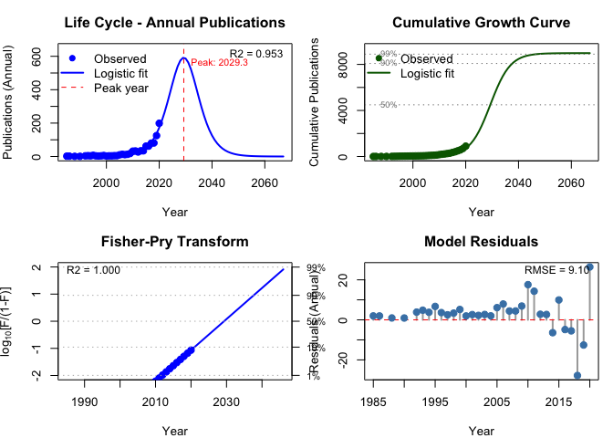
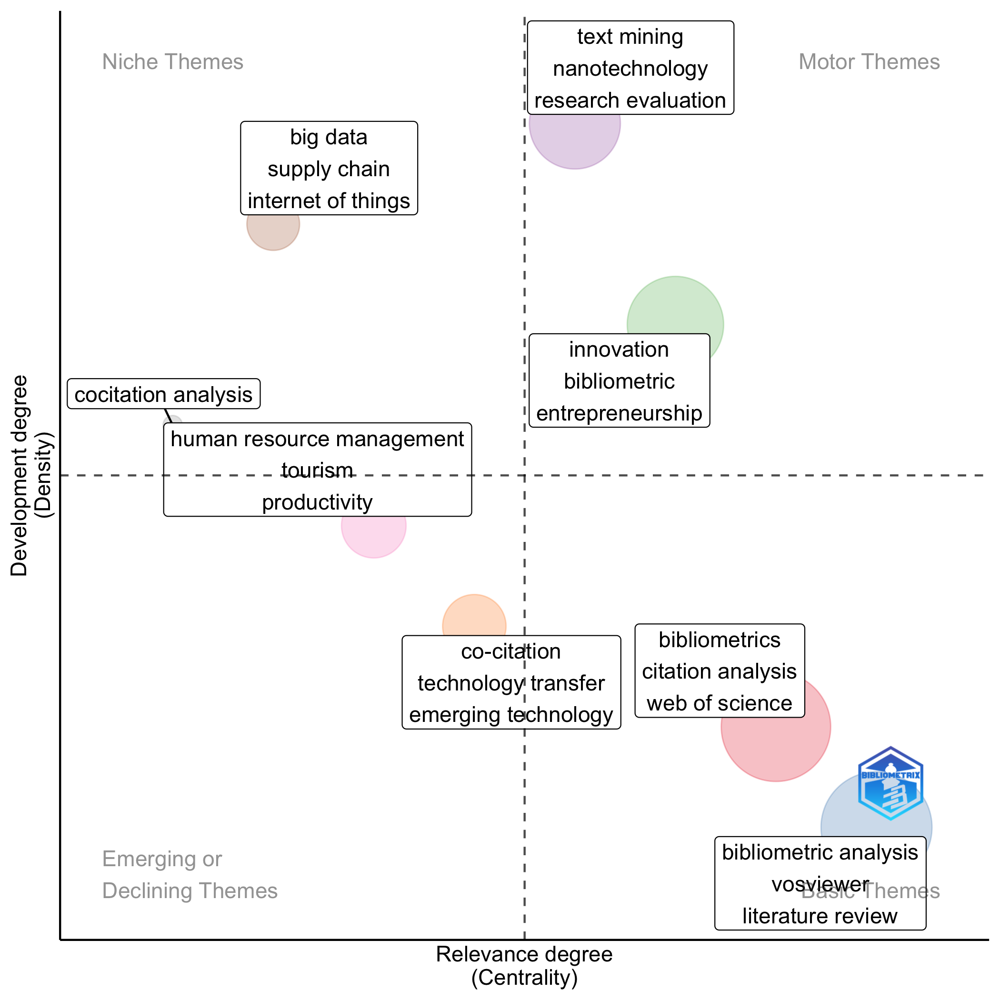
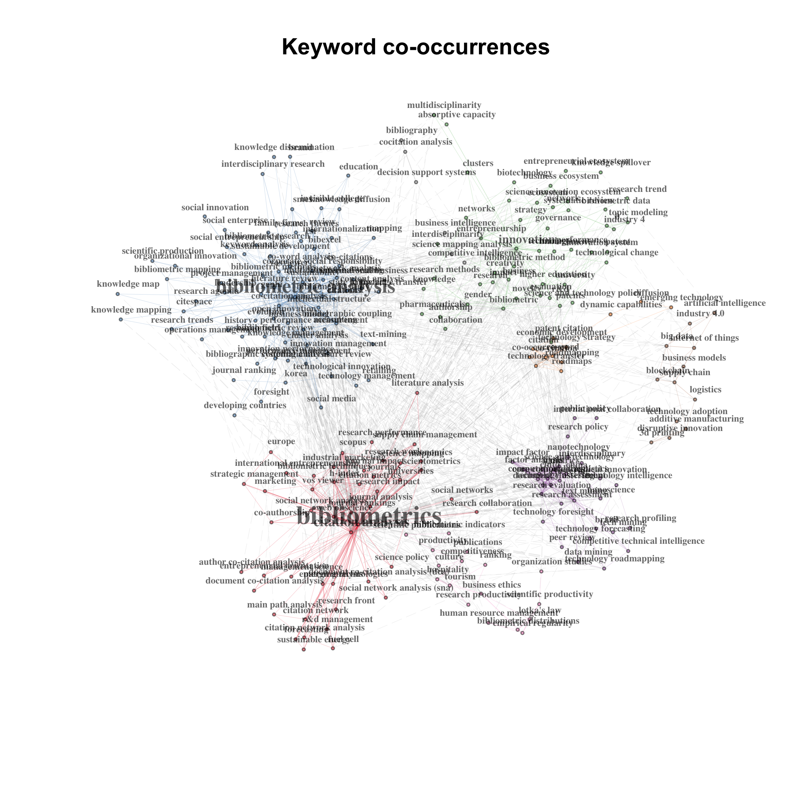
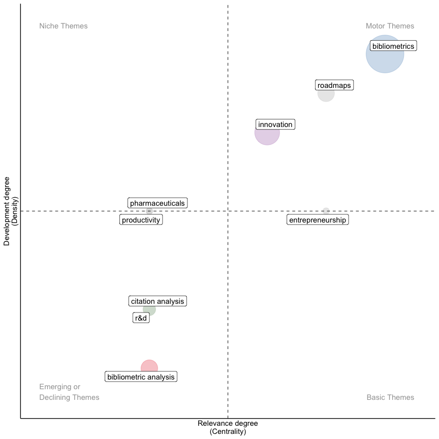
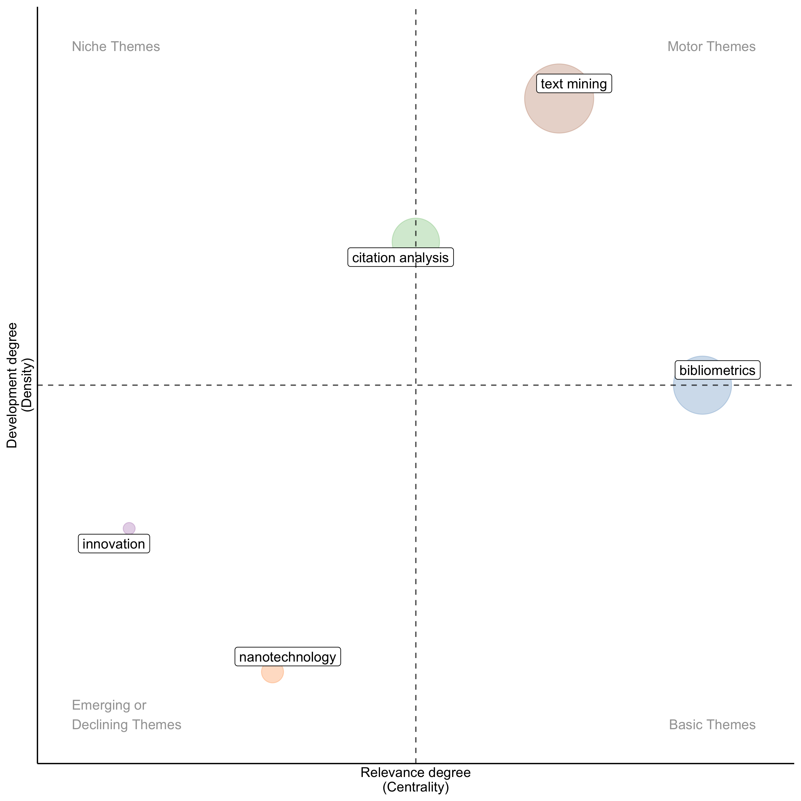
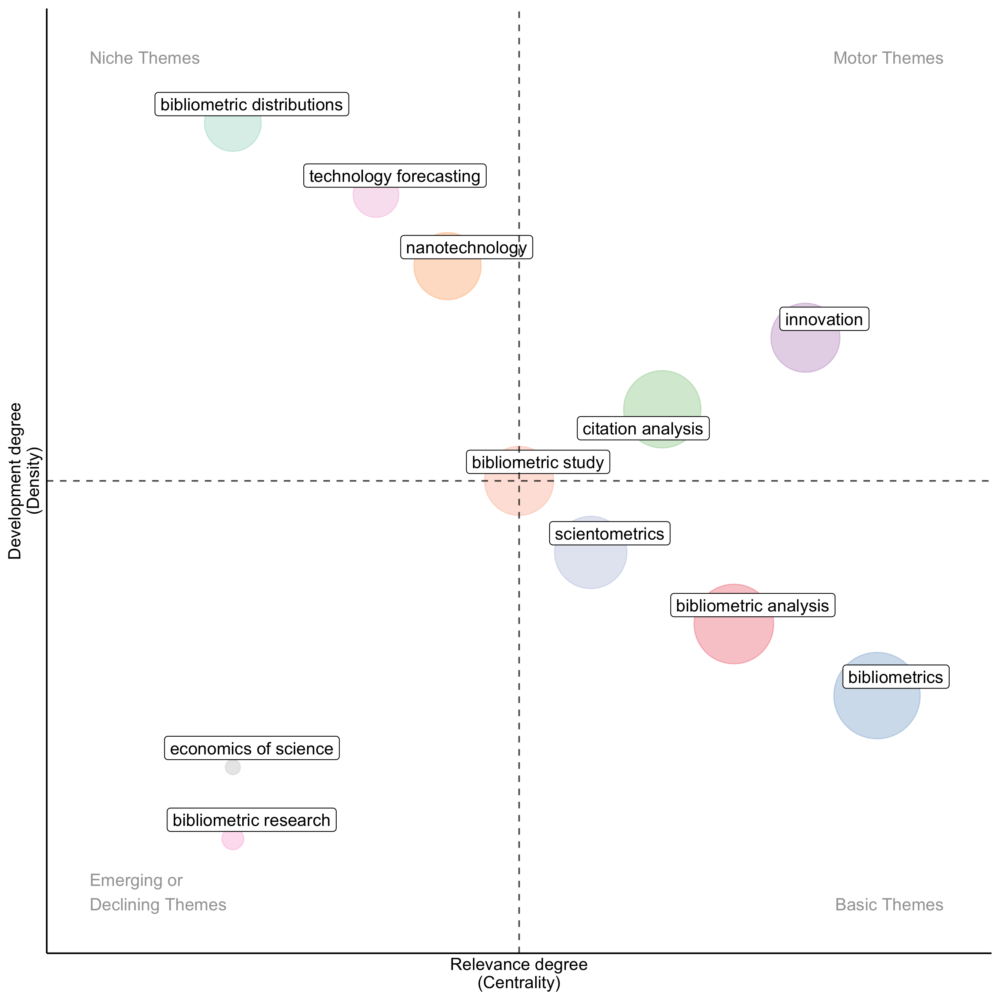
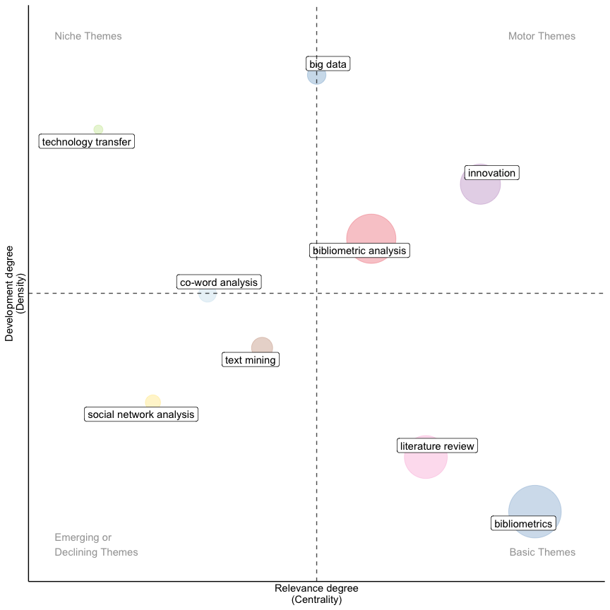
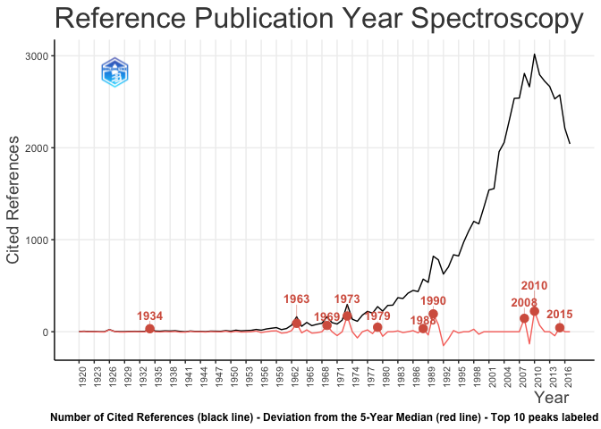

<!-- README.md is generated from README.Rmd. Please edit that file -->

# bibliometrix

## An R-tool for comprehensive science mapping analysis

[](https://doi.org/10.1016/j.joi.2017.08.007)
[](https://www.repostatus.org/#active)
[](https://github.com/massimoaria/bibliometrix/actions/workflows/R-CMD-check.yaml)
[](https://cran.r-project.org/package=bibliometrix)
[](https://github.com/r-hub/cranlogs.app)
[](https://cran.r-project.org/package=bibliometrix)

<p align="center">


</p>

## Overview

**bibliometrix** provides a comprehensive set of tools for quantitative
research in bibliometrics and scientometrics.

Bibliometrics applies quantitative analysis and statistics to scientific
publications and their citation patterns. It has become essential across
all scientific fields for evaluating growth, maturity, leading authors,
conceptual and intellectual maps, and emerging trends within research
communities.

Today, bibliometrics is widely used in research performance evaluation
by universities, government laboratories, policymakers, research
directors, information specialists, librarians, and scholars themselves.

**bibliometrix** supports scholars in three key phases of analysis:

- **Data importing and conversion** to R format from major bibliographic
  databases;

- **Bibliometric analysis** of publication datasets, including
  descriptive statistics, author productivity, and source impact;

- **Building and visualizing matrices** for co-citation, coupling,
  collaboration, and co-word analysis. These matrices serve as input for
  network analysis, multiple correspondence analysis, and other data
  reduction techniques.

## biblioshiny

**bibliometrix** includes **biblioshiny: bibliometrix for no-coders**

**biblioshiny** is a *shiny web application providing an intuitive
interface for bibliometrix*.

It enables scholars to easily access the main features of bibliometrix
through an interactive workflow:

### Data Management

- **Import and convert** data from multiple bibliographic databases (Web
  of Science, Scopus, PubMed, OpenAlex, Cochrane CDSR, Lens.org)

- **Filter data** by various criteria including publication years,
  journals, countries, citation counts, and custom journal rankings

- **Merge collections** from different databases

- **API Integration** for direct data retrieval from OpenAlex and PubMed

### Analytics and Visualization

- **Three-level metrics** for comprehensive analysis:

  - **Sources**: journal performance, impact metrics, Bradford’s law

  - **Authors**: productivity analysis, h-index, collaboration patterns,
    author profiles with biographical information

  - **Documents**: citation analysis, most relevant papers, reference
    publication year spectroscopy (RPYS)

### Knowledge Structure Analysis

- **Conceptual Structure**: analyzing the topics and themes through
  co-word analysis, thematic mapping, and thematic evolution

- **Intellectual Structure**: examining the citation networks through
  co-citation analysis, historiograph, and document coupling

- **Social Structure**: exploring collaboration patterns through
  co-authorship networks at author, institution, and country levels

### Advanced Features

- **Biblio AI**: An integrated AI assistant to help interpret results,
  generate insights, and provide context-aware recommendations

- **Life Cycle Analysis**: Track and visualize the evolution of research
  topics, authors, and documents over time

- **Animated Networks**: Dynamic visualization of diachronic networks
  showing temporal evolution

- **Content Analysis**: Advanced text mining using natural language
  processing for deeper content exploration

- **Citation Matching**: Intelligent algorithm to match and reconcile
  citations across different databases

- **Interactive Reports**: Generate comprehensive Excel reports
  combining multiple analyses

### How to use biblioshiny

To launch the application, simply run:

``` r
library(bibliometrix)
biblioshiny()
```

For detailed tutorials and guides, visit the bibliometrix website:
<https://www.bibliometrix.org/>

## How to cite bibliometrix

If you use this package for your research, please cite it as:

Aria, M. & Cuccurullo, C. (2017) **bibliometrix: An R-tool for
comprehensive science mapping analysis**, *Journal of Informetrics*,
11(4), pp 959-975, Elsevier, DOI: 10.1016/j.joi.2017.08.007

## Community

Official website: <https://www.bibliometrix.org>

CRAN page: <https://cran.r-project.org/package=bibliometrix>

GitHub repository: <https://github.com/massimoaria/bibliometrix>

### Tutorials

Introduction to bibliometrix:
<https://www.bibliometrix.org/vignettes/Introduction_to_bibliometrix.html>

Data importing and converting:
<https://www.bibliometrix.org/vignettes/Data-Importing-and-Converting.html>

## Installation

Install the stable version from CRAN:

``` r
install.packages("bibliometrix")
```

Or install the development version from GitHub:

``` r
if (!require("pak", quietly=TRUE)) install.packages("pak")
pak::pkg_install("massimoaria/bibliometrix")
```

Load `bibliometrix`:

``` r
library(bibliometrix)
#> Please note that our software is open source and available for use, distributed under the MIT license.
#> When it is used in a publication, we ask that authors properly cite the following reference:
#> 
#> Aria, M. & Cuccurullo, C. (2017) bibliometrix: An R-tool for comprehensive science mapping analysis,
#>                         Journal of Informetrics, 11(4), pp 959-975, Elsevier.
#> 
#> Failure to properly cite the software is considered a violation of the license.
#>                         
#> For information and bug reports:
#>                         - Take a look at https://www.bibliometrix.org
#>                         - Send an email to info@bibliometrix.org
#>                         - Write a post on https://github.com/massimoaria/bibliometrix/issues
#>                         
#> Help us to keep Bibliometrix and Biblioshiny free to download and use by contributing with a small donation to support our research team (https://bibliometrix.org/donate.html)
#> 
#>                         
#> To start with the Biblioshiny app, please digit:
#> biblioshiny()
```

## Data loading and converting

Export files from bibliographic databases can be imported into R using
the function **convert2df**:

**convert2df**(*file*, *dbsource*, *format*)

The argument *file* is a character vector containing the names of export
files downloaded from SCOPUS, Clarivate Analytics WoS, OpenAlex, Digital
Science Dimensions, PubMed, Lens.org, or Cochrane CDSR. The *file*
argument can also contain JSON/XML objects downloaded using OpenAlex,
Digital Science Dimensions, or PubMed APIs (through the packages
*openalexR*, *dimensionsR*, and *pubmedR*).

Example:

``` r
file <- c("file1.txt", "file2.txt", ...)
```

``` r
## An example from bibliometrix vignettes

file <- c("https://www.bibliometrix.org/datasets/management1.txt","https://www.bibliometrix.org/datasets/management2.txt")

M <- convert2df(file = file, dbsource = "wos", format = "plaintext")
#> 
#> Converting your wos collection into a bibliographic dataframe
#> 
#> Done!
#> 
#> 
#> Generating affiliation field tag AU_UN from C1:  Done!

data(management, package = "bibliometrixData")
M <- management
```

The **convert2df** function creates a bibliographic data frame where
rows correspond to manuscripts and columns to metadata fields.

Each manuscript contains multiple elements including authors’ names,
title, keywords, abstract, and other bibliographic information. All
these elements constitute the metadata of a document.

Data frame columns are named using the standard Clarivate Analytics WoS
Field Tag codes: [(Field Tags
documentation)](https://www.bibliometrix.org/documents/Field_Tags_bibliometrix.pdf)

## Checking metadata completeness

After importing a bibliographic data frame, you can assess the
completeness of metadata using **missingData()**:

**missingData**(*M*)

The argument *M* is a bibliographic data frame obtained by the
**convert2df** function.

``` r
## An example from bibliometrix vignettes

com <- missingData(M)

com$mandatoryTags
#>    tag          description missing_counts missing_pct     status
#> 1   AU               Author              0        0.00  Excellent
#> 2   DT        Document Type              0        0.00  Excellent
#> 3   SO              Journal              0        0.00  Excellent
#> 4   LA             Language              0        0.00  Excellent
#> 5   PY     Publication Year              0        0.00  Excellent
#> 6   WC   Science Categories              0        0.00  Excellent
#> 7   TI                Title              0        0.00  Excellent
#> 8   TC       Total Citation              0        0.00  Excellent
#> 9   CR     Cited References              2        0.22       Good
#> 10  AB             Abstract              7        0.78       Good
#> 11  RP Corresponding Author             10        1.11       Good
#> 12  C1          Affiliation             21        2.34       Good
#> 13  DI                  DOI             36        4.01       Good
#> 14  DE             Keywords             79        8.80       Good
#> 15  ID        Keywords Plus             97       10.80 Acceptable
```

## Bibliometric Analysis

The function **biblioAnalysis** performs a comprehensive bibliometric
analysis of a dataset, calculating main bibliometric measures.

**biblioAnalysis**(*M*, *sep = “;”*)

The argument *sep* indicates the field separator character used in the
data frame.

``` r
results <- biblioAnalysis(M, sep = ";")
```

The **biblioAnalysis** function returns an object of class
“bibliometrix” containing:

- Annual scientific production
- Most productive authors
- Most cited manuscripts
- Most productive countries
- Total citations per country  
- Most relevant sources (journals)
- Most frequent keywords

Use the generic function **summary** to display main results:

``` r
S <- summary(object = results, k = 10, pause = FALSE)
#> 
#> 
#> MAIN INFORMATION ABOUT DATA
#> 
#>  Timespan                              1985 : 2020 
#>  Sources (Journals, Books, etc)        281 
#>  Documents                             898 
#>  Annual Growth Rate %                  14.05 
#>  Document Average Age                  10.2 
#>  Average citations per doc             37.12 
#>  Average citations per year per doc    3.061 
#>  References                            43935 
#>  
#> DOCUMENT TYPES                     
#>  article                         862 
#>  article; book chapter           1 
#>  article; early access           9 
#>  article; proceedings paper      26 
#>  
#> DOCUMENT CONTENTS
#>  Keywords Plus (ID)                    1918 
#>  Author's Keywords (DE)                2243 
#>  
#> AUTHORS
#>  Authors                               2079 
#>  Author Appearances                    2657 
#>  Authors of single-authored docs       112 
#>  
#> AUTHORS COLLABORATION
#>  Single-authored docs                  121 
#>  Documents per Author                  0.432 
#>  Co-Authors per Doc                    2.96 
#>  International co-authorships %        36.41 
#>  
#> 
#> Annual Scientific Production
#> 
#>  Year    Articles
#>     1985        2
#>     1986        2
#>     1988        1
#>     1990        1
#>     1992        4
#>     1993        5
#>     1994        4
#>     1995        7
#>     1996        4
#>     1997        3
#>     1998        4
#>     1999        6
#>     2000        3
#>     2001        4
#>     2002        4
#>     2003        5
#>     2004        5
#>     2005       10
#>     2006       13
#>     2007       11
#>     2008       13
#>     2009       18
#>     2010       32
#>     2011       33
#>     2012       27
#>     2013       34
#>     2014       34
#>     2015       62
#>     2016       62
#>     2017       80
#>     2018       81
#>     2019      125
#>     2020      199
#> 
#> Annual Percentage Growth Rate 14.05 
#> 
#> 
#> Most Productive Authors
#> 
#>    Authors        Articles Authors        Articles Fractionalized
#> 1     MERIGO JM         20    KOSTOFF RN                     7.77
#> 2     PORTER AL         19    PORTER AL                      5.84
#> 3     KOSTOFF RN        16    MERIGO JM                      5.42
#> 4     KUMAR S           15    KAJIKAWA Y                     4.62
#> 5     KAJIKAWA Y        14    KUMAR S                        4.28
#> 6     ZHANG Y            9    KOSEOGLU MA                    3.07
#> 7     ABRAMO G           8    SHILBURY D                     3.00
#> 8     D'ANGELO CA        8    ABRAMO G                       2.58
#> 9     KOSEOGLU MA        8    D'ANGELO CA                    2.58
#> 10    YOUTIE J           8    CULLEN JG                      2.50
#> 
#> 
#> Top manuscripts per citations
#> 
#>                                  Paper                                     DOI   TC TCperYear   NTC
#> 1  CHEN HC, 2012, MIS QUART                     NA                             2161    154.36 15.64
#> 2  ZUPIC I, 2015, ORGAN RES METHODS             10.1177/1094428114562629        844     76.73 17.17
#> 3  RAMOS-RODRIGUEZ AR, 2004, STRATEGIC MANAGE J 10.1002/smj.397                 667     30.32  3.76
#> 4  VOLBERDA HW, 2010, ORGAN SCI                 10.1287/orsc.1090.0503          626     39.12  9.82
#> 5  DAIM TU, 2006, TECHNOL FORECAST SOC          10.1016/j.techfore.2006.04.004  569     28.45  5.67
#> 6  KOSTOFF RN, 2001, IEEE T ENG MANAGE          10.1109/17.922473               387     15.48  2.66
#> 7  NERUR SP, 2008, STRATEG MANAGE J             10.1002/smj.659                 353     19.61  3.48
#> 8  MELIN G, 2000, RES POLICY                    10.1016/S0048-7333(99)00031-1   336     12.92  2.15
#> 9  MOED HF, 1985, RES POLICY                    10.1016/0048-7333(85)90012-5    310      7.56  1.81
#> 10 MURRAY F, 2002, RES POLICY                   10.1016/S0048-7333(02)00070-7   301     12.54  2.40
#> 
#> 
#> Corresponding Author's Countries
#> 
#>           Country Articles   Freq SCP MCP MCP_Ratio
#> 1  USA                 146 0.1644  92  54     0.370
#> 2  CHINA                84 0.0946  41  43     0.512
#> 3  SPAIN                72 0.0811  51  21     0.292
#> 4  BRAZIL               65 0.0732  52  13     0.200
#> 5  ITALY                49 0.0552  31  18     0.367
#> 6  UNITED KINGDOM       47 0.0529  22  25     0.532
#> 7  GERMANY              42 0.0473  29  13     0.310
#> 8  AUSTRALIA            31 0.0349  19  12     0.387
#> 9  NETHERLANDS          31 0.0349  20  11     0.355
#> 10 INDIA                26 0.0293  17   9     0.346
#> 
#> 
#> SCP: Single Country Publications
#> 
#> MCP: Multiple Country Publications
#> 
#> 
#> Total Citations per Country
#> 
#>       Country      Total Citations Average Article Citations
#> 1  USA                        8896                     60.93
#> 2  SPAIN                      2843                     39.49
#> 3  UNITED KINGDOM             2143                     45.60
#> 4  NETHERLANDS                2110                     68.06
#> 5  CHINA                      1939                     23.08
#> 6  ITALY                      1566                     31.96
#> 7  GERMANY                    1449                     34.50
#> 8  JAPAN                      1104                     46.00
#> 9  SLOVENIA                   1100                    157.14
#> 10 BRAZIL                     1074                     16.52
#> 
#> 
#> Most Relevant Sources
#> 
#>                                                   Sources        Articles
#> 1  TECHNOLOGICAL FORECASTING AND SOCIAL CHANGE                         97
#> 2  RESEARCH POLICY                                                     83
#> 3  TECHNOLOGY ANALYSIS & STRATEGIC MANAGEMENT                          31
#> 4  JOURNAL OF BUSINESS RESEARCH                                        28
#> 5  SCIENCE AND PUBLIC POLICY                                           25
#> 6  TECHNOVATION                                                        19
#> 7  JOURNAL OF TECHNOLOGY TRANSFER                                      12
#> 8  INTERNATIONAL JOURNAL OF CONTEMPORARY HOSPITALITY MANAGEMENT        10
#> 9  INTERNATIONAL JOURNAL OF INNOVATION AND TECHNOLOGY MANAGEMENT       10
#> 10 R & D MANAGEMENT                                                    10
#> 
#> 
#> Most Relevant Keywords
#> 
#>    Author Keywords (DE)      Articles Keywords-Plus (ID)     Articles
#> 1      BIBLIOMETRICS              234 SCIENCE                     146
#> 2      BIBLIOMETRIC ANALYSIS      161 INNOVATION                  130
#> 3      CITATION ANALYSIS           62 PERFORMANCE                 117
#> 4      INNOVATION                  44 IMPACT                      116
#> 5      BIBLIOMETRIC STUDY          30 MANAGEMENT                  113
#> 6      TEXT MINING                 30 KNOWLEDGE                    82
#> 7      VOSVIEWER                   30 INTELLECTUAL STRUCTURE       75
#> 8      LITERATURE REVIEW           29 TECHNOLOGY                   62
#> 9      BIBLIOMETRIC                28 JOURNALS                     59
#> 10     CO-CITATION ANALYSIS        28 MODEL                        58
```

The *k* parameter specifies the number of rows to display in each table
(top k authors, sources, etc.). The *pause* parameter controls whether
to pause between tables.

Basic visualizations can be generated using the **plot** function:

``` r
plot(x = results, k = 10, pause = FALSE)
```


## Author Bio Cards

The **AuthorBio** function retrieves and displays biographical
information about authors using OpenAlex data:

``` r
# Example: Get biographical information for an author
authorInfo <- authorBio(author_position = 1, 
                        doi = "10.1016/j.joi.2017.08.007")

dplyr::glimpse(authorInfo)
#> Rows: 1
#> Columns: 25
#> $ id                          <chr> "https://openalex.org/A5069892096"
#> $ display_name                <chr> "Massimo Aria"
#> $ display_name_alternatives   <list> <"Massimo Aria", "Aria, Massimo", "M Aria", "M Aría", "M. Aria", "M. Qasem Aria", …
#> $ ids                         <list> <"https://openalex.org/A5069892096", "https://orcid.org/0000-0002-8517-9411">
#> $ orcid                       <chr> "https://orcid.org/0000-0002-8517-9411"
#> $ works_count                 <int> 227
#> $ cited_by_count              <int> 16124
#> $ counts_by_year              <list> [<data.frame[23 x 4]>]
#> $ `2yr_mean_citedness`        <dbl> 3.983607
#> $ h_index                     <int> 35
#> $ i10_index                   <int> 93
#> $ last_known_institutions     <list> [<data.frame[2 x 6]>]
#> $ topics                      <list> [<tbl_df[20 x 5]>]
#> $ works_api_url               <chr> "https://api.openalex.org/works?filter=author.id:A5069892096"
#> $ author_position_in_paper    <dbl> 1
#> $ original_author_name        <chr> "Massimo Aria"
#> $ is_corresponding            <lgl> TRUE
#> $ author_position_type        <chr> "first"
#> $ primary_affiliation         <chr> "University of Naples Federico II"
#> $ primary_affiliation_country <chr> "IT"
#> $ primary_affiliation_ror     <chr> "https://ror.org/05290cv24"
#> $ affiliation_raw             <chr> "Department of Economics and Statistics, Università degli Studi di Napoli Federico…
#> $ source_doi                  <chr> "10.1016/j.joi.2017.08.007"
#> $ source_title                <chr> "bibliometrix : An R-tool for comprehensive science mapping analysis"
#> $ query_timestamp             <dttm> 2025-11-07 18:40:48
```

This function provides comprehensive author profiles including:

- Institutional affiliations
- Research areas and topics
- Publication history
- Citation metrics
- Co-author networks

## Citation Matching

The **applyCitationMatching** function implements an intelligent
algorithm to match and reconcile citations across different databases:

``` r
# Apply citation matching to improve reference consistency
results <- applyCitationMatching(management, threshold = 0.85)
```

This feature is particularly useful when:

- Merging datasets from multiple databases
- Identifying duplicate or variant citations
- Building accurate citation networks
- Conducting historiographic analysis

## Life Cycle Analysis

The **lifeCycle** function analyzes the temporal evolution of research
topics, identifying different phases in their development:

``` r
# Perform life cycle analysis
data <- M %>% group_by(PY) %>% count()
LC <- lifeCycle(data, forecast_years = 20, plot = TRUE, verbose = FALSE)
```



``` r

print(LC$parameters)
#>          K         tm    delta_t 
#> 8980.00000   45.30838   16.67067

print(LC$metrics)
#>   R_squared     RMSE      AIC      BIC
#> 1 0.9526706 9.101654 151.7581 156.2476
```

The \*\*Life Cycle of Scientific Production\* function implements a
logistic growth model to analyze the temporal dynamics of research
topics. This approach, grounded in the theory of scientific paradigms
and innovation diffusion, allows researchers to identify the current
developmental stage of a field, predict future trends, and estimate when
a topic will reach maturity or saturation.

By fitting a logistic curve to the annual publication counts in your
collection, this analysis reveals whether a research area is in its
emergence phase, rapid growth phase, maturity phase, or decline phase.

## Bibliographic network matrices

Manuscript attributes are interconnected through the publications
themselves: authors link to journals, keywords to publication dates, and
references create citation networks.

These connections form bipartite networks that can be represented as
rectangular matrices (Manuscripts × Attributes).

Additionally, scientific publications regularly cite other works,
generating co-citation and coupling networks that reveal the
intellectual structure of research fields.

### biblioNetwork function

The **biblioNetwork** function calculates the most frequently used
bibliometric networks from a bibliographic data frame:

**Analysis types:** - **Coupling**: Documents sharing references -
**Co-citation**: References cited together - **Co-occurrences**:
Keywords or terms appearing together  
- **Collaboration**: Co-authorship patterns

**Network levels:** - Authors - References - Sources (journals) -
Countries - Universities - Keywords (Author keywords or Keywords Plus) -
Titles - Abstracts

Example - classical co-citation network:

``` r
NetMatrix <- biblioNetwork(M, analysis = "co-citation", network = "references", sep = ";")
```

## Visualizing bibliographic networks

Bibliographic networks can be visualized and analyzed using the
**networkPlot** function, which offers multiple layout algorithms and
customization options.

The main argument *type* specifies the network layout: circle,
kamada-kawai, fruchterman-reingold, mds, etc.

### Country Scientific Collaboration

``` r
# Create a country collaboration network

M <- metaTagExtraction(M, Field = "AU_CO", sep = ";")
NetMatrix <- biblioNetwork(M, analysis = "collaboration", network = "countries", sep = ";")

# Plot the network
net <- networkPlot(NetMatrix, n = dim(NetMatrix)[1], Title = "Country Collaboration", 
                   type = "circle", size = TRUE, remove.multiple = FALSE, labelsize = 0.8)
```


This visualization reveals international research collaborations,
highlighting countries with strong scientific partnerships.

### Co-Citation Network

``` r
# Create a co-citation network

NetMatrix <- biblioNetwork(M, analysis = "co-citation", network = "references", n = 30, sep = ";")

# Plot the network
net <- networkPlot(NetMatrix, Title = "Co-Citation Network", type = "fruchterman", 
                   size = TRUE, remove.multiple = FALSE, labelsize = 0.7, edgesize = 5)
```


Co-citation analysis identifies the intellectual foundations of a
research field by revealing which references are frequently cited
together.

### Keyword Co-occurrences

``` r
# Create keyword co-occurrences network

NetMatrix <- biblioNetwork(M, analysis = "co-occurrences", network = "keywords", sep = ";")

# Plot the network
net <- networkPlot(NetMatrix, normalize = "association", weighted = TRUE, n = 30, 
                   Title = "Keyword Co-occurrences", type = "fruchterman", 
                   size = TRUE, edgesize = 5, labelsize = 0.7)
```


Keyword co-occurrence networks reveal the conceptual structure of a
research field, identifying main themes and their relationships.

### Thematic Map

The thematicMap function creates a **strategic diagram** based on
co-word network analysis and clustering. It plots themes in a
two-dimensional space according to their centrality (measure of
importance) and density (measure of development).

This visualization helps identify:

\- Motor Themes (well-developed and central),

\- Niche Themes (well-developed but peripheral),

\- Emerging or Declining Themes (weakly developed), and

\- Basic Themes (important but not well-developed).

The methodology is based on Cobo et al. (2011) co-word analysis
approach.

``` r
# Create a Thematic Map
thematicMapResults <- thematicMap(M, field = "DE", n = 250, minfreq = 5, 
                                  stemming = FALSE, size = 0.3, n.labels = 3, 
                                  repel = TRUE, cluster="louvain")
plot(thematicMapResults$map)
```



``` r
plot(thematicMapResults$net$graph)
```



### Thematic Evolution

The thematicEvolution function analyzes how themes evolve over time by
dividing the collection into multiple time periods and tracking thematic
changes across them. It performs a thematic map analysis for each period
and measures the conceptual relationships between themes in consecutive
periods using inclusion indexes and stability measures. This
longitudinal analysis reveals emerging topics, declining themes, stable
research areas, and thematic transformations.

The function produces an interactive Sankey-like diagram showing
thematic flows between periods, along with strategic maps for each time
slice.

``` r
# Thematic Evolution
TEResults <- thematicEvolution(M, field = "DE", n = 250, 
                                              minFreq = 5, stemming = FALSE, 
                                              size = 0.3, n.labels = 1, 
                                              repel = TRUE, cluster="louvain", 
                                              years = c(2004, 2008, 2015))
plotThematicEvolution(TEResults$Nodes, TEResults$Edges, measure="weighted")
```


#### 1985-2004

``` r
# 1985-2004
plot(TEResults$TM[[1]]$map)
```



#### 2005-2008

``` r

# 2005-2008
plot(TEResults$TM[[2]]$map)
```



#### 2009-2015

``` r


# 2009-2015
plot(TEResults$TM[[3]]$map)
```



#### 2016-2020

``` r

# 2016-2020
plot(TEResults$TM[[4]]$map)
```



## Co-Word Analysis: The conceptual structure of a field

Co-word analysis maps the conceptual structure of a research domain by
examining word co-occurrences in a bibliographic collection.

The analysis employs dimensionality reduction techniques including: -
**Multiple Correspondence Analysis (MCA)** - **Correspondence Analysis
(CA)** - **Multidimensional Scaling (MDS)**

The **conceptualStructure** function performs CA or MCA to visualize the
conceptual structure and uses K-means clustering to identify document
clusters sharing common themes. Results are displayed on two-dimensional
maps.

The function includes natural language processing (NLP) routines (see
**termExtraction**) to extract terms from titles and abstracts, and
implements Porter’s stemming algorithm to reduce words to their root
form.

``` r
# Conceptual Structure using keywords (method="MCA")

CS <- conceptualStructure(M, field = "ID", method = "MCA", minDegree = 10, 
                          clust = 5, stemming = FALSE, labelsize = 15, 
                          documents = 20, graph = FALSE)

plot(CS$graph_terms)
```


``` r
plot(CS$graph_dendogram)
```


This analysis helps identify: - Main research themes and sub-themes -
Relationships between concepts - Evolution of research focus - Emerging
topics and declining areas

## Referenced Publication Years Spectroscopy (RPYS)

RPYS analysis examines the age distribution of cited references to
identify seminal works and breakthrough moments in a research field. The
**rpys** function provides advanced capabilities for detecting:

``` r
# Perform RPYS analysis
rpysResults <- rpys(M, sep = ";", timespan = NULL, graph = TRUE)
```



``` r

print(rpysResults$Sequences %>% filter(Class!="") %>% group_by(Class) %>% slice_max(order_by=Freq,n=3, with_ties = FALSE) %>% arrange(desc(RPY),.by_group = TRUE), n=30)
#> # A tibble: 18 × 5
#> # Groups:   Class [7]
#>    CR                                            RPY    Freq sequence                       Class                       
#>    <chr>                                         <chr> <dbl> <chr>                          <chr>                       
#>  1 "MERIGO JM 2015 J BUS RES "                   2015     36 oooooo                         Constant Performer          
#>  2 "DAIM TU 2006 TECHNOL FORECAST SOC "          2006     51 ooooooooooo+oo-                Constant Performer          
#>  3 "RAMOS-RODRIGUEZ AR 2004 STRATEGIC MANAGE J " 2004    108 ooooo-o+ooo-o-+o+              Constant Performer          
#>  4 "ACEDO FJ 2005 INT BUS REV "                  2005     30 oo+o+++ooooo--oo               Constant Performer+Life Cyc…
#>  5 "TSENG YH 2007 INFORM PROCESS MANAG "         2007     14 o++ooooooo-oo-                 Hot Paper                   
#>  6 "ZHOU P 2006 RES POLICY "                     2006     14 o+++oo+oo--oooo                Hot Paper                   
#>  7 "KOSTOFF RN 2002 J POWER SOURCES "            2002     13 +++o+ooooo++oo---              Hot Paper                   
#>  8 "SHIBATA N 2009 J AM SOC INF SCI TEC "        2009      8 ++ooo++ooo--                   Hot Paper+Life Cycle        
#>  9 "DE SOLLA PRICE D. 1963 LITTLE SCI BIG SCI"   1963     25 o++oo+++oooo+++ooo-o-o-        Hot Paper+Life Cycle        
#> 10 "BARNEY J 1991 J MANAGE "                     1991     73 oo--ooooooooo-oo---oooo-+o++o  Life Cycle                  
#> 11 "SMALL H 1973 J AM SOC INFORM SCI "           1973    120 oooo-oo-ooooooooooo--oo-ooo++  Life Cycle                  
#> 12 "PRITCHARD A 1969 J DOC "                     1969     74 ooooooooooo-ooo-ooo++          Life Cycle                  
#> 13 "ARIA M 2017 J INFORMETR "                    2017     19 o--+                           Sleeping Beauty             
#> 14 "NERUR SP 2008 STRATEG MANAGE J "             2008     67 o--oo+-o+-o+o                  Sleeping Beauty             
#> 15 "MCCAIN KW 1990 J AM SOC INFORM SCI "         1990     63 --oooo+oooooooooooo+o+-oo+ooo  Sleeping Beauty             
#> 16 "VAN ECK NJ 2010 SCIENTOMETRICS "             2010    124 o------o-++                    Sleeping Beauty+Life Cycle  
#> 17 "COHEN WM 1990 ADMIN SCI QUART "              1990     61 --o-oooo+ooooooo-o-oo-oooo++o  Sleeping Beauty+Life Cycle  
#> 18 "EISENHARDT KM 1989 ACAD MANAGE REV "         1989     43 o--o--oooooooooooo-oooooooo++o Sleeping Beauty+Life Cycle
```

The analysis identifies four types of influential references:

- **Hot Papers**: Recently published works receiving immediate, intense
  attention
- **Constant Performers**: Works consistently cited over extended
  periods
- **Life Cycles**: Publications showing typical rise and fall patterns
  in citation frequency
- **Sleeping Beauties**: Works initially overlooked but later recognized
  as significant contributions

RPYS helps researchers: - Identify foundational works in a field -
Detect breakthrough moments and paradigm shifts - Understand citation
patterns over time - Discover underappreciated but important
contributions

## Historical Direct Citation Network

The historiograph, proposed by Eugene Garfield, represents a
chronological network of the most relevant direct citations in a
bibliographic collection.

The **histNetwork** function generates a chronological direct citation
network matrix that can be visualized using **histPlot**:

``` r
# Create a historical citation network

histResults <- histNetwork(M, sep = ";")
#> 
#> WOS DB:
#> Searching local citations (LCS) by reference items (SR) and DOIs...
#> 
#> Analyzing 62646 reference items...
#> 
#> Found 422 documents with no empty Local Citations (LCS)

# Plot a historical citation network
net <- histPlot(histResults, n = 20, size = FALSE, label = "short")
```


    #> 
    #>  Legend
    #> 
    #>                                                                         Label
    #> 1                  MOED HF, 1985, RES POLICY DOI 10.1016/0048-7333(85)90012-5
    #> 2                           HOFFMAN DL, 1993, J CONSUM RES DOI 10.1086/209319
    #> 3      PORTER AL, 1995, TECHNOL FORECAST SOC DOI 10.1016/0040-1625(95)00022-3
    #> 4      WATTS RJ, 1997, TECHNOL FORECAST SOC DOI 10.1016/S0040-1625(97)00050-4
    #> 5                   KOSTOFF RN, 2001, IEEE T ENG MANAGE DOI 10.1109/17.922473
    #> 6                VERBEEK A, 2002, INT J MANAG REV DOI 10.1111/1468-2370.00083
    #> 7            RAMOS-RODRIGUEZ AR, 2004, STRATEGIC MANAGE J DOI 10.1002/SMJ.397
    #> 8      DAIM TU, 2006, TECHNOL FORECAST SOC DOI 10.1016/J.TECHFORE.2006.04.004
    #> 9  SCHILDT HA, 2006, ENTREP THEORY PRACT DOI 10.1111/J.1540-6520.2006.00126.X
    #> 10         CASILLAS J, 2007, FAM BUS REV DOI 10.1111/J.1741-6248.2007.00092.X
    #> 11                       NERUR SP, 2008, STRATEG MANAGE J DOI 10.1002/SMJ.659
    #> 12                  PODSAKOFF PM, 2008, J MANAGE DOI 10.1177/0149206308319533
    #> 13  KAJIKAWA Y, 2008, TECHNOL FORECAST SOC DOI 10.1016/J.TECHFORE.2007.05.005
    #> 14             LANDSTROM H, 2012, RES POLICY DOI 10.1016/J.RESPOL.2012.03.009
    #> 15             FAGERBERG J, 2012, RES POLICY DOI 10.1016/J.RESPOL.2012.03.008
    #> 16                  SHAFIQUE M, 2013, STRATEGIC MANAGE J DOI 10.1002/SMJ.2002
    #> 17              ZUPIC I, 2015, ORGAN RES METHODS DOI 10.1177/1094428114562629
    #> 18               MERIGO JM, 2015, J BUS RES DOI 10.1016/J.JBUSRES.2015.04.006
    #> 19             LAENGLE S, 2017, EUR J OPER RES DOI 10.1016/J.EJOR.2017.04.027
    #> 20           VALENZUELA L, 2017, J BUS IND MARK DOI 10.1108/JBIM-04-2016-0079
    #>                                                                                                                                                                                                                        Author_Keywords
    #> 1                                                                                                                                                                                                                                 <NA>
    #> 2                                                                                                                                                                                                                                 <NA>
    #> 3                                                                                                                                                                                                                                 <NA>
    #> 4                                                                                                                                                                                                                                 <NA>
    #> 5  BIBLIOMETRICS; CITATION; CO-CITATION; CO-OCCURRENCE; CO-WORD; DECISION AIDS; PATENT CITATION; RETROSPECTIVE ANALYSES; ROADMAPPING; ROADMAPS; SCIENCE AND TECHNOLOGY; TECHNOLOGY INSERTION; TECHNOLOGY STRATEGY; TECHNOLOGY TRANSFER
    #> 6                                                                                                                                                                                                                                 <NA>
    #> 7                                                                                                                                                                   STRATEGIC MANAGEMENT RESEARCH; BIBLIOMETRICS; CO-CITATION ANALYSIS
    #> 8                                                                                                                                                                                                                                 <NA>
    #> 9                                                                                                                                                                                                                                 <NA>
    #> 10                                                                                                                                                                                                                                <NA>
    #> 11                                                                                                                  AUTHOR CO-CITATION ANALYSIS; PATHFINDER ANALYSIS; INFORMATION THEORY; STRATEGIC MANAGEMENT RESEARCH; BIBLIOMETRICS
    #> 12                                                                                                                                                     CITATION ANALYSIS; BIBLIOMETRIC TECHNIQUES; SCHOLARLY IMPACT; UNIVERSITY IMPACT
    #> 13                                                                                                                           EMERGING TECHNOLOGIES; FORECASTING; CITATION NETWORK; BIBLIOMETRICS; SUSTAINABLE ENERGY; RENEWABLE ENERGY
    #> 14                                                                                                                                                                  ENTREPRENEURSHIP; RESEARCH FIELD; HANDBOOKS; BIBLIOMETRIC ANALYSIS
    #> 15                                                                                                                                                    INNOVATION STUDIES; NEW SCIENTIFIC FIELDS; SPECIALISMS; BIBLIOMETRICS; HANDBOOKS
    #> 16                                                                                                                                      INNOVATION; MULTIDISCIPLINARITY; KNOWLEDGE CONVERGENCE; ABSORPTIVE CAPACITY; CREATIVE CAPACITY
    #> 17                                                                                                                                                                 BIBLIOMETRICS; CO-CITATION; BIBLIOGRAPHIC COUPLING; SCIENCE MAPPING
    #> 18                                                                                                                                                                  BUSINESS RESEARCH; BIBLIOMETRICS; WEB OF SCIENCE; JOURNAL ANALYSIS
    #> 19                                                                                                                                          OPERATIONAL RESEARCH; MANAGEMENT SCIENCE; BIBLIOMETRICS; WEB OF SCIENCE; CITATION ANALYSIS
    #> 20                                                                                                                                      BIBLIOMETRICS; SCIENCE MAPPING; BUSINESS MARKETING; JOURNAL OF BUSINESS & INDUSTRIAL MARKETING
    #>                                                                                                                                                                                                                                         KeywordsPlus
    #> 1                                                                                                                                                                                                                                               <NA>
    #> 2                                                                                                                                                                                 SCIENTOMETRIC TRANSACTION MATRICES; CO-CITATION ANALYSIS; NETWORKS
    #> 3                                                                                                                                                                                                                                               <NA>
    #> 4                                                                                                                                                                                                                              TECHNOLOGY; DIFFUSION
    #> 5                                                                                                                                                                                                        TECHNICAL INTELLIGENCE; DATABASE TOMOGRAPHY
    #> 6                                                                                                                                UNIVERSITY-RESEARCH PERFORMANCE; CITATION ANALYSIS; BASIC RESEARCH; CO-CITATION; ECONOMICS; FLANDERS; POLICY; FIELD
    #> 7                                                                                              AUTHOR COCITATION ANALYSIS; DIVERSIFICATION STRATEGY; COMPETITIVE ADVANTAGE; LOCAL SEARCH; KNOWLEDGE; FIRM; PERFORMANCE; IMPACT; DISCIPLINE; BEHAVIOR
    #> 8                                                                                                                                                                                                                                               <NA>
    #> 9                                                                                                                                                                VENTURE PERFORMANCE; KNOWLEDGE; ORGANIZATIONS; INNOVATION; CREATION; CONTEXT; ENTRY
    #> 10                                                                                                                                                               AUTHOR COCITATION ANALYSIS; LIMITATIONS; PARADIGMS; SYSTEMS; SCIENCE; POLICY; FIRMS
    #> 11                                                                                                                                                                                         CITATION ANALYSIS; JOURNALS; SYSTEMS; DISCIPLINE; SCIENCE
    #> 12                                                                                                                   RESEARCH PRODUCTIVITY; JOB-PERFORMANCE; JOURNALS; FACULTY; SCIENCE; MODEL; INFORMETRICS; METAANALYSIS; PERSONALITY; RECOGNITION
    #> 13                                                                                                                                                              HYDROGEN FUTURES; BIBLIOMETRICS; POLICY; SCIENCE; RENEWABLES; MECHANISMS; PRIORITIES
    #> 14                                                                                                                                                    SCIENCE POLICY; INNOVATION; ECONOMICS; GROWTH; SPILLOVERS; DISCOVERY; EMERGENCE; MARKET; FIELD
    #> 15                                                                                                                                                                                                                         SOCIAL-SCIENCE; ECONOMICS
    #> 16                                                                                                                                                              SCIENTIFIC LITERATURES; AUTHOR COCITATION; CITATION ANALYSIS; MANAGEMENT; TECHNOLOGY
    #> 17 PRODUCT-INNOVATION-MANAGEMENT; EXPLORATORY FACTOR-ANALYSIS; AUTHOR COCITATION ANALYSIS; INTELLECTUAL STRUCTURE; STRATEGIC-MANAGEMENT; BUSINESS ETHICS; ENTREPRENEURSHIP-RESEARCH; OPERATIONS MANAGEMENT; ABSORPTIVE-CAPACITY; INFORMATION-SCIENCE
    #> 18                                                                                                                                      RETROSPECTIVE EVALUATION; RESEARCH PRODUCTIVITY; ECONOMICS; AUTHORS; MANAGEMENT; ARTICLES; RANKINGS; DECADES
    #> 19                                                                                                                                                                                                                     MANAGEMENT SCIENCE; ECONOMICS
    #> 20                                                                                                                                                                                                                          PRODUCT; HISTORY; IMPACT
    #>                                 DOI Year LCS GCS
    #> 1      10.1016/0048-7333(85)90012-5 1985  22 310
    #> 2                    10.1086/209319 1993  34 127
    #> 3      10.1016/0040-1625(95)00022-3 1995  20 165
    #> 4     10.1016/S0040-1625(97)00050-4 1997  18 168
    #> 5                 10.1109/17.922473 2001  19 387
    #> 6           10.1111/1468-2370.00083 2002  18 117
    #> 7                   10.1002/smj.397 2004 108 667
    #> 8    10.1016/j.techfore.2006.04.004 2006  51 569
    #> 9  10.1111/j.1540-6520.2006.00126.x 2006  35 167
    #> 10 10.1111/j.1741-6248.2007.00092.x 2007  21 101
    #> 11                  10.1002/smj.659 2008  67 353
    #> 12         10.1177/0149206308319533 2008  32 271
    #> 13   10.1016/j.techfore.2007.05.005 2008  25 160
    #> 14     10.1016/j.respol.2012.03.009 2012  21 186
    #> 15     10.1016/j.respol.2012.03.008 2012  22 174
    #> 16                 10.1002/smj.2002 2013  20 132
    #> 17         10.1177/1094428114562629 2015  71 844
    #> 18    10.1016/j.jbusres.2015.04.006 2015  36 179
    #> 19       10.1016/j.ejor.2017.04.027 2017  22 165
    #> 20        10.1108/JBIM-04-2016-0079 2017  25 118

The historiograph reveals: - The chronological development of ideas in a
field - Key publications and their influence over time - Citation paths
showing knowledge flow - Temporal relationships between foundational
works

This visualization is particularly valuable for understanding how
scientific knowledge evolves and builds upon previous research.

## Main Authors’ References

### Core bibliometrix publication

Aria, M. & Cuccurullo, C. (2017). **bibliometrix: An R-tool for
comprehensive science mapping analysis**, *Journal of Informetrics*,
11(4), pp 959-975, Elsevier, DOI: 10.1016/j.joi.2017.08.007
(<https://doi.org/10.1016/j.joi.2017.08.007>)

### Recent methodological advances

M. Aria, C. Cuccurullo, L. D’Aniello, M. Misuraca, M. Spano (2024).
**Comparative science mapping: a novel conceptual structure analysis
with metadata**, *Scientometrics*.
(<https://doi.org/10.1007/s11192-024-05161-6>)

Aria, M., Le, T., Cuccurullo, C., Belfiore, A., & Choe, J. (2024).
**openalexR: An R-Tool for Collecting Bibliometric Data from OpenAlex**.
*The R Journal*, [DOI:
10.32614/RJ-2023-089](https://doi.org/10.32614/RJ-2023-089).

### Applications in various domains

Aria, M., D’Aniello, L., Grassia, M. G., Marino, M., Mazza, R., &
Stavolo, A. (2024). **Mapping the evolution of gender dysphoria
research: a comprehensive bibliometric study**. *Quality & Quantity*,
58(6), 5351-5375.

Aria, M., Cuccurullo, C., D’Aniello, L., Misuraca, M., & Spano, M.
(2022). **Thematic Analysis as a New Culturomic Tool: The Social Media
Coverage on COVID-19 Pandemic in Italy**. *Sustainability*, 14(6), 3643,
(<https://doi.org/10.3390/su14063643>)

Aria M., Misuraca M., Spano M. (2020) **Mapping the evolution of social
research and data science on 30 years of Social Indicators Research**,
*Social Indicators Research*.
(<https://doi.org/10.1007/s11205-020-02281-3>)

Aria M., Alterisio A., Scandurra A, Pinelli C., D’Aniello B, (2021)
**The scholar’s best friend: research trends in dog cognitive and
behavioural studies**, *Animal Cognition*.
(<https://doi.org/10.1007/s10071-020-01448-2>)

Angelelli, M., Ciavolino, E., Ringle, C. M., Sarstedt, M., & Aria, M.
(2025). **Conceptual structure and thematic evolution in partial least
squares structural equation modeling research**. *Quality & Quantity*,
1-46.

Belfiore, A., Cuccurullo, C., & Aria, M. (2022). **IoT in healthcare: A
scientometric analysis**. *Technological Forecasting and Social Change*,
184, 122001. (<https://doi.org/10.1016/j.techfore.2022.122001>)

Ciavolino, E., Aria, M., Cheah, J. H., & Roldán, J. L. (2022). **A tale
of PLS structural equation modelling: episode I—a bibliometrix citation
analysis**. *Social Indicators Research*, 164(3), 1323-1348
(<https://doi.org/10.1007/s11205-022-02994-7>).

D’Aniello, L., Spano, M., Cuccurullo, C., & Aria, M. (2022). **Academic
Health Centers’ configurations, scientific productivity, and impact:
insights from the Italian setting**. *Health Policy*.
(<https://doi.org/10.1016/j.healthpol.2022.09.007>)

Sarto, F., Cuccurullo, C., & Aria, M. (2014). **Exploring healthcare
governance literature: systematic review and paths for future
research**. *Mecosan*
(<https://www.francoangeli.it/Riviste/Scheda_Rivista.aspx?IDarticolo=52780&lingua=en>)

Scarano, A., Aria, M., Mauriello, F., Riccardi, M. R., & Montella, A.
(2023). **Systematic literature review of 10 years of cyclist safety
research**. *Accident Analysis & Prevention*, 184, 106996
(<https://doi.org/10.1016/j.aap.2023.106996>).
