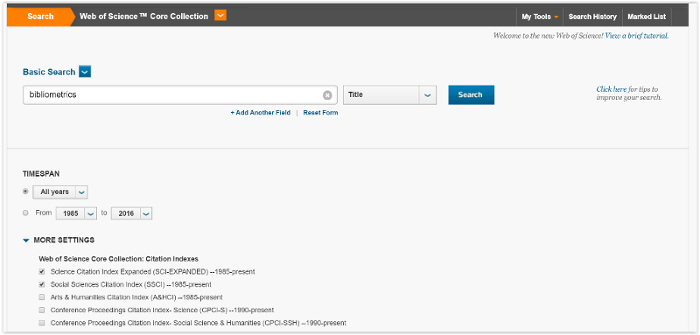
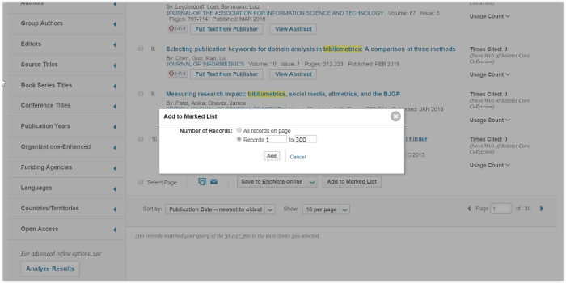
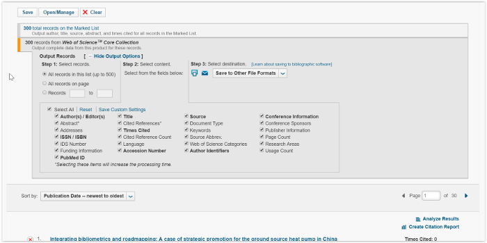
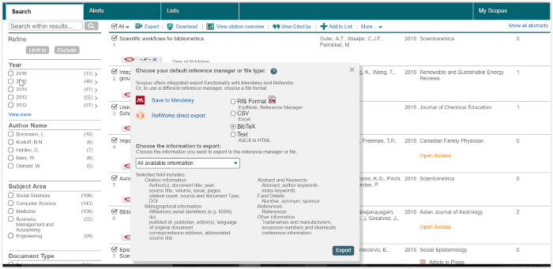
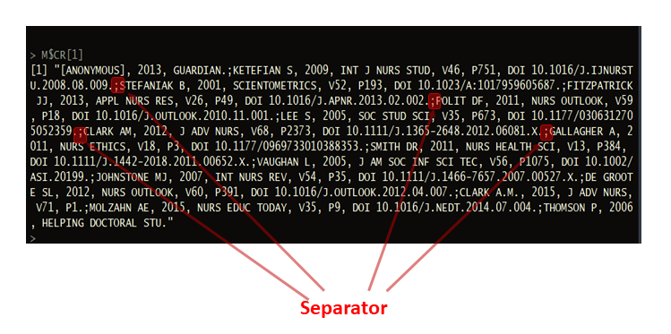

<center>
<div style="width:450px; height=300px">

</div>
</center>

#### https://www.bibliometrix.org

#### Latest version
```{r echo=FALSE}
cat(paste("bibliometrix ",packageVersion("bibliometrix")))
```

&nbsp; 

&nbsp; 

&nbsp; 

### Citation for package 'bibliometrix'


To cite bibliometrix in publications, please use:

**Aria, M. & Cuccurullo, C. (2017) bibliometrix: An R-tool for comprehensive science mapping analysis, Journal of Informetrics, 11(4), pp 959-975, Elsevier.**
 
&nbsp; 

&nbsp; 

A BibTeX entry for LaTeX users is
 
@Article{,

   author = {Massimo Aria and Corrado Cuccurullo},

   title = {bibliometrix: An R-tool for comprehensive science mapping analysis},

   journal = {Journal of Informetrics},

   volume = {11},

   number = {4},

   pages = {959-975},

   publisher = {Elsevier},

   year = {2017},

   url = {https://doi.org/10.1016/j.joi.2017.08.007},

   }

&nbsp; 

&nbsp; 

&nbsp; 

```{r Package citation, eval=FALSE, include=FALSE}
citation("bibliometrix")
```


&nbsp; 

&nbsp; 

&nbsp; 


### Authors' affiliations

#### Dr. Massimo Aria

Full Professor in Social Statistics 

PhD in Computational Statistics

Laboratory and Research Group STAD Statistics, Technology, Data Analysis

Department of Economics and Statistics 

University of Naples Federico II

email aria@unina.it

http://www.massimoaria.com

&nbsp; 

&nbsp; 

&nbsp; 


#### Dr. Corrado Cuccurullo

Full Professor in Strategy and Corporate Governance 

PhD in Management

Dep.t of Management and Economics

University of Campania Luigi Vanvitelli

email corrado.cuccurullo@unicampania.it

https://sites.google.com/site/cocuccurunina2/

&nbsp; 

&nbsp; 

&nbsp; 

&nbsp; 

&nbsp;

&nbsp; 


# Introduction

**bibliometrix** package provides a set of tools for quantitative research in bibliometrics and scientometrics.

Bibliometrics turns the main tool of science, quantitative analysis, on itself. Essentially, bibliometrics is the application of quantitative analysis and statistics to publications such as journal articles and their accompanying citation counts. Quantitative evaluation of publication and citation data is now used in almost all scientific fields to evaluate growth, maturity, leading authors, conceptual and intellectual maps, trends of a scientific community.

Bibliometrics is also used in research performance evaluation, especially in university and government labs, and also by policymakers, research directors and administrators, information specialists and librarians, and scholars themselves.

**bibliometrix** supports scholars in three key phases of analysis:

* Data importing and conversion to R format; 

* Bibliometric analysis of a publication dataset;

* Building matrices for co-citation, coupling, collaboration, and co-word analysis. Matrices are the input data for performing network analysis, multiple correspondence analysis, and any other data reduction techniques.

## Bibliographic databases
**bibliometrix** works with data extracted from the four main bibliographic databases: SCOPUS, Clarivate Analytics Web of Science, Cochrane Database of Systematic Reviews (CDSR) and RISmed PubMed/MedLine.

*SCOPUS* (https://www.scopus.com), founded in 2004, offers a great deal of flexibility for the bibliometric user.  It permits to query for different fields, such as titles, abstracts, keywords, references and so on. SCOPUS allows for relatively easy downloading data-queries, although there are some limits on very large results sets with over 2,000 items.

*Clarivate Analytics Web of Science (WoS)* (https://www.webofknowledge.com), owned by Clarivate Analytics, was founded by Eugene Garfield, one of the pioneers of bibliometrics.  
This platform includes many different collections.

*Cochrane Database of Systematic Reviews* (https://www.cochranelibrary.com/cdsr/about-cdsr) is the leading resource for systematic reviews in health care. The CDSR includes Cochrane Reviews (the systematic reviews) and protocols for Cochrane Reviews as well as editorials. The CDSR also has occasional supplements. The CDSR is updated regularly as Cochrane Reviews are published "when ready" and form monthly issues; see publication schedule.

*PubMed* comprises more than 28 million citations for biomedical literature from MEDLINE, life science journals, and online books. Citations may include links to full-text content from PubMed Central and publisher websites.

## Data acquisition
Bibliographic data may be obtained by querying the SCOPUS or Clarivate Analytics Web of Science (WoS) database by diverse fields, such as topic, author, journal, timespan, and so on.

In this example, we show how to download data, querying a term in the manuscript title field.

We choose the generic term "bibliometrics".

### Querying from Clarivate Analytics WoS
At the link https://www.webofknowledge.com, select Web of Science Core Collection database. 

Write the keyword "bibliometrics" in the search field and select title from the drop-down menu (see figure 1).  

<div style="width:900px; height=600px">

</div>


Choose SCI-EXPANDED and SSCI citation indexes.

The search yielded 291 results on May 09, 2016.

Results can be refined using options on the left side of the page (the type of manuscript, source, subject category, etc.).

After refining the query, you can add records to your Marked List by clicking the button "add to marked list" at the end of the page and selecting the records to save (see figure 2).

<div style="width:900px; height=600px">

</div>


The Marked List page provides you with a list of publications selected and various means of exporting data. 

To export the data you desire, choose the export tool and follow the three intuitive steps (see figure 3).

<div style="width:900px; height=600px">

</div>


The export tool allows you to select the diverse fields to save. So, select the fields you are interested in (for example all the available data about marked records).


To download an export file, in an appropriate format for the *bibliometrix* package, make sure to select the option "**Save to Other File Formats**" and choose Bibtex or Plain Text.

The WoS platform permits to export only 500 records at a time. 

The Clarivate Analytics Web of Science export tool creates an export file with a default name "savedrecs" with an extension ".txt" or ".bib" for plain text or BibTeX  format respectively. Export files can be separately stored.

### Querying from SCOPUS
The access to SCOPUS is via https://www.scopus.com.

To find all articles whose title includes the term "bibliometrics", simply write this keyword in the field and select "Article Title" (see figure 4)

<div style="width:900px; height=600px">

</div>

The search yielded 414 results on May 09, 2016.

You can download the references (up to 2,000 full records) by checking the 'Select All' box and clicking on the link 'Export'. 
Choose the file type "BibTeX  export" and "all available information" (see figure 5).


<div style="width:900px; height=600px">

</div>


The SCOPUS export tool creates an export file with the default name "scopus.bib".

## bibliometrix installation

Download and install the most recent version of R (https://cran.r-project.org)

Download and install the most recent version of Rstudio (https://rstudio.com)

Open Rstudio, in the console window, digit:

install.packages("bibliometrix", dependencies=TRUE)      ### installs bibliometrix package and dependencies


```{r bibliometrix loading}
library(bibliometrix)   ### load bibliometrix package
```

## Data loading and converting

The export file can be read and converted using by R using the function *convert2df*:

**convert2df**(*file*, *dbsource*, *format*)

The argument *file* is a character vector containing the name of export files downloaded from SCOPUS, Clarivate Analytics WOS, Digital Science Dimenions, PubMed or Cochrane CDSR website. *file* can also contains the name of a json/xlm object download using  Digital Science Dimenions or PubMed APIs (through the packages *dimensionsR* and *pubmedR*.

es. file <- c("file1.txt","file2.txt", ...)

```{r Data converting}
file <- "https://www.bibliometrix.org/datasets/savedrecs.bib"

M <- convert2df(file = file, dbsource = "isi", format = "bibtex")
```

*convert2df* creates a bibliographic data frame with cases corresponding to manuscripts and variables to Field Tag in the original export file.

*convert2df* accepts two additional arguments: *dbsource* and *format*.

The argument *dbsource* indicates from which database the collection has been downloaded. 

It can be: 

- "isi" or "wos" (for Clarivate Analytics Web of Science database), 

- "scopus" (for SCOPUS database), 

- "dimensions" (for DS Dimensions database)

- "pubmed" (for PubMed/Medline database),  

- "cochrane" (for Cochrane Library database of systematic reviews).

The argument *format* indicates the file format of the imported collection. It can be "plaintext" or "bibtex" for WOS collection and mandatorily "bibtext" for SCOPUS collection. The argument is ignored if the collection comes from Pubmed or Cochrane.

Each manuscript contains several elements, such as authors' names, title, keywords and other information. All these elements constitute the bibliographic attributes of a document, also called metadata.

Data frame columns are named using the standard Clarivate Analytics WoS Field Tag codify. 

The main field tags are:

Field Tag  | Description
---------- | -----------
AU		     | Authors
TI		     | Document Title
SO		     | Publication Name (or Source)
JI		     | ISO Source Abbreviation
DT		     | Document Type
DE		     | Authors' Keywords
ID		     | Keywords associated by SCOPUS or ISI database
AB		     | Abstract
C1		     | Author Address
RP		     | Reprint Address
CR		     | Cited References
TC		     | Times Cited
PY		     | Year
SC		     | Subject Category
UT		     | Unique Article Identifier
DB		     | Bibliographic Database


For a complete list of field tags see https://www.bibliometrix.org/documents/Field_Tags_bibliometrix.pdf

## Bibliometric Analysis

The first step is to perform a descriptive analysis of the bibliographic data frame.

The function *biblioAnalysis* calculates main bibliometric measures using this syntax:
 
```{r biblioAnalysis}
results <- biblioAnalysis(M, sep = ";")
```

The function *biblioAnalysis* returns an object of class "bibliometrix".

An object of class "bibliometrix" is a list containing the following components:

List element       | Description
------------------ | --------------------------------------------
Articles		 | the total number of manuscripts
Authors		   | the authors' frequency distribution
AuthorsFrac	 | the authors' frequency distribution (fractionalized)
FirstAuthors | corresponding author of each manuscript
nAUperPaper	 | the number of authors per manuscript
Appearances |  the number of author appearances
nAuthors		 | the number of authors
AuMultiAuthoredArt | the number of authors of multi-authored articles
MostCitedPapers | the list of manuscripts sorted by citations
Years		     | publication year of each manuscript
FirstAffiliation | the affiliation of the corresponding author
Affiliations | the frequency distribution of affiliations (of all co-authors for each paper)
Aff_frac		 | the fractionalized frequency distribution of affiliations (of all co-authors for each paper)
CO		       | the affiliation country of the corresponding author
Countries		 | the affiliation countries' frequency distribution
CountryCollaboration | the intra-country (SCP) and inter-country (MCP) collaboration indices
TotalCitation | 		 the number of times each manuscript has been cited
TCperYear		 | the yearly average number of times each manuscript has been cited
Sources		   | the frequency distribution of sources (journals, books, etc.)
DE		       | the frequency distribution of authors' keywords
ID		       | the frequency distribution of keywords associated to the manuscript by SCOPUS and Thomson Reuters' ISI Web of Knowledge databases

### Functions *summary* and *plot*

To summarize main results of the bibliometric analysis, use the generic function *summary*.
It displays main information about the bibliographic data frame and several tables, such as annual scientific production, top manuscripts per number of citations, most productive authors, most productive countries, total citation per country, most relevant sources (journals) and most relevant keywords.

Main information table describes the collection size in terms of number of documents, number of authors, number of sources, number of keywords, timespan, and average number of citations. 

Furthermore, many different co-authorship indices are shown. In particular, the **Authors per Article index** is calculated as the ratio between the total number of authors and the total number of articles. The **Co-Authors per Articles index** is calculated as the average number of co-authors per article. In this case, the index takes into account the author appearances while for the "authors per article" an author, even if he has published more than one article, is counted only once.
For that reasons,  *Authors per Article index $\le$ Co-authors per Article index*.

The **Collaboration Index** (CI) is calculated as Total Authors of Multi-Authored Articles/Total Multi-Authored Articles (Elango and Rajendran, 2012; Koseoglu, 2016). In other word, the Collaboration Index is a Co-authors per Article index calculated only using the multi-authored article set.

Elango, B., & Rajendran, P. (2012). Authorship trends and collaboration pattern in the marine sciences literature: a scientometric study. International Journal of Information Dissemination and Technology, 2(3), 166.

Koseoglu, M. A. (2016). Mapping the institutional collaboration network of strategic management research: 1980–2014. Scientometrics, 109(1), 203-226.


*summary* accepts two additional arguments. *k* is a formatting value that indicates the number of rows of each table. *pause* is a logical value (TRUE or FALSE) used to allow (or not) pause in screen scrolling.
Choosing k=10 you decide to see the first 10 Authors, the first 10 sources, etc.

```{r summary generic function}
options(width=100)
S <- summary(object = results, k = 10, pause = FALSE)
```

Some basic plots can be drawn using the generic function \code{plot}:

```{r plot generic function, fig.width=7}
plot(x = results, k = 10, pause = FALSE)
```

## Analysis of Cited References 
The function *citations* generates the frequency table of the most cited references or the most cited first authors (of references).

For each manuscript, cited references are in a single string stored in the column "CR" of the data frame. 

For a correct extraction, you need to identify the separator field among different references, used by ISI or SCOPUS database. Usually, the default separator is ";" or `".  "` (a dot with double space).

```{r}
# M$CR[1]
```
The figure shows the reference string of the first manuscript. In this case, the separator field is `sep = ";"`.

<div style="width:900px; height=600px">

</div>


To obtain the most frequent cited manuscripts:
```{r Article citation}
CR <- citations(M, field = "article", sep = ";")
cbind(CR$Cited[1:10])
```

To obtain the most frequent cited first authors:
```{r Author citation}
CR <- citations(M, field = "author", sep = ";")
cbind(CR$Cited[1:10])
```

The function *localCitations* generates the frequency table of the most local cited authors.
Local citations measure how many times an author (or a document) included in this collection have been cited by other authors also in the collection.

To obtain the most frequent local cited authors:
```{r Local Author citation}
CR <- localCitations(M, sep = ";")
CR$Authors[1:10,]
CR$Papers[1:10,]
```


## Authors' Dominance ranking

The function *dominance* calculates the authors' dominance ranking as proposed by Kumar & Kumar, 2008.

Kumar, S., & Kumar, S. (2008). Collaboration in research productivity in oil seed research institutes of India. In Proceedings of Fourth International Conference on Webometrics, Informetrics and Scientometrics.

Function arguments are: *results* (object of class *bibliometrix*) obtained by *biblioAnalysis*; and *k* (the number of authors to consider in the analysis).

```{r Dominance Ranking}
DF <- dominance(results, k = 10)
DF
```

The Dominance Factor is a ratio indicating the fraction of multi-authored articles in which a scholar appears as the first author.

In this example, Kostoff and Holden dominate their research team because they appear as the first authors in all their papers (8 for Kostoff and 3 for Holden). 

## Authors' h-index
The h-index is an author-level metric that attempts to measure both the productivity and citation impact of the publications of a scientist or scholar. 

The index is based on the set of the scientist's most cited papers and the number of citations that they have received in other publications.

The function *Hindex* calculates the authors' H-index or the sources' H-index and its variants (g-index and m-index) in a bibliographic collection.

Function arguments are: *M* a bibliographic data frame; *field* is character element that defines the unit of analysis in terms of authors (field = "auhtor") or sources (field = "source"); *elements* a character vector containing the authors' names (or the sources' names) for which you want to calculate the H-index. The argument has the form c("SURNAME1 N","SURNAME2 N",...). 

In other words, for each author: surname and initials are separated by one blank space. 
i.e for the authors ARIA MASSIMO and CUCCURULLO CORRADO, *elements* argument is *elements = c("ARIA M", "CUCCURULLO C")*.

To calculate the h-index of Lutz Bornmann in this collection:

```{r h-index}

indices <- Hindex(M, field = "author", elements="BORNMANN L", sep = ";", years = 10)

# Bornmann's impact indices:
indices$H

# Bornmann's citations
indices$CitationList

```

To calculate the h-index of the first 10 most productive authors (in this collection):

```{r h-index 10 authors}

authors=gsub(","," ",names(results$Authors)[1:10])

indices <- Hindex(M, field = "author", elements=authors, sep = ";", years = 50)

indices$H
```


## Top-Authors' Productivity over the Time

The function *AuthorProdOverTime* calculates and plots the authors' production (in terms of number of publications, and total citations per year) over the time.

Function arguments are: *M* a bibliographic data frame; *k* is the number of *k* Top Authors; *graph* is a logical. If *graph=TRUE*, the function plots the author production over time graph. 

```{r AuthorProdOverTime, fig.height=6, fig.width=8}

topAU <- authorProdOverTime(M, k = 10, graph = TRUE)

## Table: Author's productivity per year
head(topAU$dfAU)

## Table: Auhtor's documents list
#head(topAU$dfPapersAU)
```


## Lotka's Law coefficient estimation
The function *lotka* estimates Lotka's law coefficients for scientific productivity (Lotka A.J., 1926).

Lotka's law describes the frequency of publication by authors in any given field as an inverse square law, where the number of authors publishing a certain number of articles is a fixed ratio to the number of authors publishing a single article.
This assumption implies that the theoretical beta coefficient of Lotka's law is equal to 2.

Using *lotka* function is possible to estimate the Beta coefficient of our bibliographic collection and assess, through a statistical test, the similarity of this empirical distribution with the theoretical one.

```{r Lotka law}
L <- lotka(results)

# Author Productivity. Empirical Distribution
L$AuthorProd

# Beta coefficient estimate
L$Beta

# Constant
L$C

# Goodness of fit
L$R2

# P-value of K-S two sample test
L$p.value

```

The table L$AuthorProd shows the observed distribution of scientific productivity in our example.

The estimated Beta coefficient is 3.05 with a goodness of fit equal to 0.94. Kolmogorov-Smirnoff two sample test provides a p-value 0.09 that means there is not a significant difference between the observed and the theoretical Lotka distributions.

You can compare the two distributions using *plot* function:

```{r Lotka law comparison, out.width='300px', dpi=200}
# Observed distribution
Observed=L$AuthorProd[,3]

# Theoretical distribution with Beta = 2
Theoretical=10^(log10(L$C)-2*log10(L$AuthorProd[,1]))

plot(L$AuthorProd[,1],Theoretical,type="l",col="red",ylim=c(0, 1), xlab="Articles",ylab="Freq. of Authors",main="Scientific Productivity")
lines(L$AuthorProd[,1],Observed,col="blue")
legend(x="topright",c("Theoretical (B=2)","Observed"),col=c("red","blue"),lty = c(1,1,1),cex=0.6,bty="n")
```


## Bibliographic network matrices
Manuscript's attributes are connected to each other through the manuscript itself: author(s) to journal, keywords to publication date, etc.

These connections of different attributes generate bipartite networks that can be represented as rectangular matrices (Manuscripts x Attributes).

Furthermore, scientific publications regularly contain references to
other scientific works. This generates a further network, namely, co-citation or coupling network.

These networks are analyzed in order to capture meaningful properties of the underlying research system, and in particular to determine the influence of bibliometric units such as scholars and journals.

### Bipartite networks
*cocMatrix* is a general function to compute a bipartite network selecting one of the metadata attributes.

For example, to create a network *Manuscript x Publication Source* you have to use the field tag "SO":

```{r Bipartite network}
A <- cocMatrix(M, Field = "SO", sep = ";")
```

A is a rectangular binary matrix, representing a bipartite network where rows and columns are manuscripts and sources respectively. 

The generic element $a_{ij}$ is 1 if the manuscript $i$ has been published in source $j$, 0 otherwise. 

The $j-th$ column sum $a_j$ is the number of manuscripts published in source $j$. 

Sorting, in decreasing order, the column sums of A, you can see the most relevant publication sources:

```{r Most relevant sources}
sort(Matrix::colSums(A), decreasing = TRUE)[1:5]
```


Following this approach, you can compute several bipartite networks:

* Citation network
```{r}
A <- cocMatrix(M, Field = "CR", sep = ".  ")
```

* Author network
```{r}
 A <- cocMatrix(M, Field = "AU", sep = ";")
```

* Country network

Authors' Countries is not a standard attribute of the bibliographic data frame. You need to extract this information from affiliation attribute using the function *metaTagExtraction*.

```{r}
M <- metaTagExtraction(M, Field = "AU_CO", sep = ";")
# A <- cocMatrix(M, Field = "AU_CO", sep = ";")
```

*metaTagExtraction* allows to extract the following additional field tags: *Authors' countries* (`Field = "AU_CO"`); *First Author's countries* (`Field = "AU_CO"`); *First author of each cited reference* (`Field = "CR_AU"`); *Publication source of each cited reference* (`Field = "CR_SO"`); and *Authors' affiliations* (`Field = "AU_UN"`).

* Author keyword network
```{r}
A <- cocMatrix(M, Field = "DE", sep = ";")
```

* Keyword Plus network
```{r}
A <- cocMatrix(M, Field = "ID", sep = ";")
```

* Etc.

### Bibliographic coupling 

Two articles are said to be bibliographically coupled if at least one cited source appears in the bibliographies or reference lists of both articles (Kessler, 1963).

A coupling network can be obtained using the general formulation:

$$
B = A \times A^T
$$
where A is a bipartite network.

Element $b_{ij}$ indicates how many bibliographic couplings exist between manuscripts $i$ and $j$. In other words, $b_{ij}$ gives the number of paths of length 2, via which one moves from $i$ along the arrow and then to $j$ in the opposite direction.

$B$ is a symmetrical matrix $B = B^T$.

The strength of the coupling of two articles, $i$ and $j$ is defined
simply by the number of references that the articles have in common, as given by the element $b_{ij}$ of matrix $B$.

The function *biblioNetwork* calculates, starting from a bibliographic  data frame, the most frequently used coupling networks: Authors, Sources, and Countries.

*biblioNetwork* uses two arguments to define the network to compute:

* *analysis* argument can be "co-citation", "coupling", "collaboration",  or "co-occurrences".

* *network* argument can be "authors", "references", "sources", "countries", "universities", "keywords", "author_keywords", "titles" and "abstracts".

The following code calculates a classical article coupling network:
```{r}
NetMatrix <- biblioNetwork(M, analysis = "coupling", network = "references", sep = ".  ")
```

Articles with only a few references, therefore, would tend to be more weakly bibliographically coupled, if coupling strength is measured simply according to the number of references that articles contain in common. 

This suggests that it might be more practical to switch to a relative measure of bibliographic coupling.

*normalizeSimilarity* function calculates Association strength, Inclusion, Jaccard or Salton similarity among vertices of a network. *normalizeSimilarity* can be recalled directly from *networkPlot()* function using the argument *normalize*. 

```{r similarity, fig.height=9, fig.width=9, warning=FALSE}
NetMatrix <- biblioNetwork(M, analysis = "coupling", network = "authors", sep = ";")


#net=networkPlot(NetMatrix,  normalize = "salton", weighted=NULL, n = 100, Title = "Authors' Coupling", type = "fruchterman", size=5,size.cex=T,remove.multiple=TRUE,labelsize=0.8,label.n=10,label.cex=F)

```


### Bibliographic co-citation

We talk about co-citation of two articles when
both are cited in a third article. Thus, co-citation can be seen as the counterpart of bibliographic coupling.

A co-citation network can be obtained using the general formulation:

$$
C = A^T \times A
$$
where A is a bipartite network.

Like matrix $B$, matrix $C$ is also symmetric. The main diagonal
of $C$ contains the number of cases in which a reference is cited in our data frame. 

In other words, the diagonal element $c_{i}$ is the number of local citations of the reference $i$.

Using the function *biblioNetwork*, you can calculate a classical reference co-citation network:
```{r}
# NetMatrix <- biblioNetwork(M, analysis = "co-citation", network = "references", sep = ".  ")
```

### Bibliographic collaboration

Scientific collaboration network is a network where nodes are authors and links are co-authorships as the latter is one of the most well-documented forms of scientific collaboration (Glanzel, 2004).

An author collaboration network can be obtained using the general formulation:

$$
AC = A^T \times A
$$
where A is a bipartite network *Manuscripts x Authors*.

The diagonal element $ac_{i}$ is the number of manuscripts authored or co-authored by researcher $i$.

Using the function *biblioNetwork*, you can calculate an authors' collaboration network:
```{r}
# NetMatrix <- biblioNetwork(M, analysis = "collaboration", network = "authors", sep = ";")
```

or a country collaboration network:
```{r}
# NetMatrix <- biblioNetwork(M, analysis = "collaboration", network = "countries", sep = ";")
```

## Descriptive analysis of network graph characteristics

The function *networkStat* calculates several summary statistics.

In particular, starting from a bibliographic matrix (or an *igraph* object), two groups of descriptive measures are computed:

* The summary statistics of the network; 

* The main indices of centrality and prestige of vertices.

```{r}
# An example of a classical keyword co-occurrences network

NetMatrix <- biblioNetwork(M, analysis = "co-occurrences", network = "keywords", sep = ";")
netstat <- networkStat(NetMatrix)
```


### The summary statistics of the network

This group of statistics allows to describe the structural properties of a network:

* **Size** is the number of vertices composing the network;

* **Density** is the proportion of present edges from all possible edges in the network;

* **Transitivity** is the ratio of triangles to connected triples;

* **Diameter** is the longest geodesic distance (length of the shortest path between two nodes) in the network;

* **Degree distribution** is the cumulative distribution of vertex degrees;

* **Degree centralization** is the normalized degree of the overall network;

* **Closeness centralization** is the normalized inverse of the vertex average geodesic distance to others in the network;

* **Eigenvector centralization** is the first eigenvector of the graph matrix;

* **Betweenness centralization** is the normalized number of geodesics that pass through the vertex;

* **Average path length** is the mean of the shortest distance between each pair of vertices in the network.

```{r}
names(netstat$network)
```

### The main indices of centrality and prestige of vertices

These measures help to identify the most important vertices in a network and the propensity of two vertices that are connected to be both connected to a third vertex.

The statistics, at vertex level, returned by *networkStat* are:

* **Degree centrality**

* **Closeness centrality** measures how many steps are required to access every other vertex from a given vertex;

* **Eigenvector centrality** is a measure of being well-connected connected to the well-connected;

* **Betweenness centrality** measures brokerage or gatekeeping potential. It is (approximately) the number of shortest paths between vertices that pass through a particular vertex;

* **PageRank score** approximates probability that any message will arrive to a particular vertex. This algorithm was developed by Google founders, and originally applied to website links;

* **Hub Score** estimates the value of the links outgoing from the vertex. It was initially applied to the web pages;

* **Authority Score** is another measure of centrality initially applied to the Web. A vertex has high authority when it is linked by many other vertices that are linking many other vertices;

* **Vertex Ranking** is an overall vertex ranking obtained as a linear weighted combination of the centrality and prestige vertex measures. The weights are proportional to the loadings of the first component of the Principal Component Analysis.

```{r}
names(netstat$vertex)
```

To summarize the main results of the *networkStat* function, use the generic function *summary*.
It displays the main information about the network and vertex description through several tables.

*summary* accepts one additional argument. *k* is a formatting value that indicates the number of rows of each table. 
Choosing k=10, you decide to see the first 10 vertices.

```{r}
summary(netstat, k=10)
```


## Visualizing bibliographic networks

All bibliographic networks can be graphically visualized or
modeled.

Here, we show how to visualize networks using function *networkPlot* and *VOSviewer software* by Nees Jan van Eck and Ludo Waltman (https://www.vosviewer.com).

Using the function *networkPlot*, you can plot a network created by *biblioNetwork* using R routines or using *VOSviewer*.

The main argument of *networkPlot* is type. It indicates the network map layout: circle, kamada-kawai, mds, etc.
Choosing type="vosviewer", the function automatically: (i) saves the network into a pajek network file, named "vosnetwork.net"; (ii) starts an instance of VOSviewer which will map the file "vosnetwork.net".
You need to declare, using argument *vos.path*, the full path of the folder where VOSviewer software is located (es. vos.path='c:/software/VOSviewer').


### Country Scientific Collaboration

```{r Country collaboration, fig.height=7, fig.width=7, warning=FALSE}
# Create a country collaboration network

M <- metaTagExtraction(M, Field = "AU_CO", sep = ";")
NetMatrix <- biblioNetwork(M, analysis = "collaboration", network = "countries", sep = ";")

# Plot the network
net=networkPlot(NetMatrix, n = dim(NetMatrix)[1], Title = "Country Collaboration", type = "circle", size=TRUE, remove.multiple=FALSE,labelsize=0.7,cluster="none")

```


### Co-Citation Network

```{r Co-citation network, fig.height=7, fig.width=7, warning=FALSE}
# Create a co-citation network

# NetMatrix <- biblioNetwork(M, analysis = "co-citation", network = "references", sep = ";")

# Plot the network
#net=networkPlot(NetMatrix, n = 30, Title = "Co-Citation Network", type = "fruchterman", size=T, remove.multiple=FALSE, labelsize=0.7,edgesize = 5)

```

### Keyword co-occurrences

```{r Keyword c-occurrences, fig.height=7, fig.width=7, warning=FALSE}
# Create keyword co-occurrences network

NetMatrix <- biblioNetwork(M, analysis = "co-occurrences", network = "keywords", sep = ";")

# Plot the network
net=networkPlot(NetMatrix, normalize="association", weighted=T, n = 30, Title = "Keyword Co-occurrences", type = "fruchterman", size=T,edgesize = 5,labelsize=0.7)

```

## Co-Word Analysis: The conceptual structure of a field 
The aim of the co-word analysis is to map the conceptual structure of a framework using the word co-occurrences in a bibliographic collection.

The analysis can be performed through dimensionality reduction techniques such as Multidimensional Scaling (MDS), Correspondence Analysis (CA) or Multiple Correspondence Analysis (MCA). 

Here, we show an example using the function *conceptualStructure* that performs a CA or MCA to draw a conceptual structure of the field and K-means clustering to identify clusters of documents which express common concepts. Results are plotted on a two-dimensional map.

*conceptualStructure* includes natural language processing (NLP) routines (see the function *termExtraction*) to extract terms from titles and abstracts.  In addition, it implements the Porter's stemming algorithm to reduce inflected (or sometimes derived) words to their word stem, base or root form.


```{r Co-Word Analysis, fig.height=9, fig.width=9, warning=FALSE}

# Conceptual Structure using keywords (method="CA")

CS <- conceptualStructure(M,field="ID", method="CA", minDegree=4, clust=5, stemming=FALSE, labelsize=10, documents=10)

```

## Historical Direct Citation Network
The historiographic map is a graph proposed by E. Garfield (2004) to represent a chronological network map of most relevant direct citations resulting from a bibliographic collection.

Garfield, E. (2004). Historiographic mapping of knowledge domains literature. Journal of Information Science, 30(2), 119-145.

The function \code{histNetwork} generates a chronological direct citation network matrix which can be plotted using *histPlot*:

```{r Historical Co-citation network, fig.height=7, fig.width=10, warning=FALSE}
# Create a historical citation network
options(width=130)
histResults <- histNetwork(M, min.citations = 1, sep = ";")

# Plot a historical co-citation network
net <- histPlot(histResults, n=15, size = 10, labelsize=5)

```

## Main Authors' references (about bibliometrics)

Aria, M. & Cuccurullo, C. (2017).  *bibliometrix*: An R-tool for comprehensive science mapping
  analysis, *Journal of Informetrics*, 11(4), pp 959-975, Elsevier, DOI: 10.1016/j.joi.2017.08.007 (https://doi.org/10.1016/j.joi.2017.08.007).

Cuccurullo, C., Aria, M., & Sarto, F. (2016). Foundations and trends in performance management. A twenty-five years bibliometric analysis in business and public administration domains, *Scientometrics*, DOI: 10.1007/s11192-016-1948-8 (https://doi.org/10.1007/s11192-016-1948-8).


Cuccurullo, C., Aria, M., & Sarto, F.  (2015). Twenty years of research on performance management in business and public administration domains. Presentation at the *Correspondence Analysis and Related Methods conference (CARME 2015)* in September 2015 (https://www.bibliometrix.org/documents/2015Carme_cuccurulloetal.pdf).


Sarto, F., Cuccurullo, C., & Aria, M. (2014). Exploring healthcare governance literature: systematic review and paths for future research. *Mecosan* (https://www.francoangeli.it/Riviste/Scheda_Rivista.aspx?IDarticolo=52780&lingua=en).


Cuccurullo, C., Aria, M., & Sarto, F. (2013). Twenty years of research on performance management in business and public administration domains. In *Academy of Management Proceedings* (Vol. 2013, No. 1, p. 14270). Academy of Management (https://doi.org/10.5465/AMBPP.2013.14270abstract).

