<div style="width:450px; height=300px">

</div>

#### http://www.bibliometrix.org

#### Latest version

```
## bibliometrix  1.9.4
```

&nbsp; 

&nbsp; 

&nbsp; 

### Citation for package 'bibliometrix'


To cite bibliometrix in publications, please use:

**Aria, M. & Cuccurullo, C. (2017) bibliometrix: An R-tool for comprehensive science mapping analysis, Journal of Informetrics, 11(4), pp 959-975, Elsevier.**
 
&nbsp; 

&nbsp; 

A BibTeX entry for LaTeX users is
 
@Article{,

   author = {Massimo Aria and Corrado Cuccurullo},

   title = {bibliometrix: An R-tool for comprehensive science mapping analysis},

   journal = {Journal of Informetrics},

   volume = {11},

   number = {4},

   pages = {959-975},

   publisher = {Elsevier},

   year = {2017},

   url = {https://doi.org/10.1016/j.joi.2017.08.007},

   }

&nbsp; 

&nbsp; 

&nbsp; 


&nbsp; 

&nbsp; 

&nbsp; 


### Authors' affiliations

#### Dr. Massimo Aria

Associate Professor in Social Statistics 

PhD in Computational Statistics

Laboratory and Research Group STAD Statistics, Technology, Data Analysis

Department of Economics and Statistics 

University of Naples Federico II

email aria@unina.it

http://www.massimoaria.com

&nbsp; 

&nbsp; 

&nbsp; 


#### Dr. Corrado Cuccurullo

Full Professor in Strategy and Corporate Governance 

PhD in Management

Dep.t of Management and Economics

University of Campania Luigi Vanvitelli

email corrado.cuccurullo@unicampania.it

https://sites.google.com/site/cocuccurunina2/

&nbsp; 

&nbsp; 

&nbsp; 

&nbsp; 

&nbsp;

&nbsp; 


# Introduction

**bibliometrix** package provides a set of tools for quantitative research in bibliometrics and scientometrics.

Bibliometrics turns the main tool of science, quantitative analysis, on itself. Essentially, bibliometrics is the application of quantitative analysis and statistics to publications such as journal articles and their accompanying citation counts. Quantitative evaluation of publication and citation data is now used in almost all scientific fields to evaluate growth, maturity, leading authors, conceptual and intellectual maps, trends of a scientific community.

Bibliometrics is also used in research performance evaluation, especially in university and government labs, and also by policymakers, research directors and administrators, information specialists and librarians, and scholars themselves.

**bibliometrix** supports scholars in three key phases of analysis:

* Data importing and conversion to R format; 

* Bibliometric analysis of a publication dataset;

* Building matrices for co-citation, coupling, collaboration, and co-word analysis. Matrices are the input data for performing network analysis, multiple correspondence analysis, and any other data reduction techniques.

## Bibliographic databases
**bibliometrix** works with data extracted from the four main bibliographic databases: SCOPUS, Clarivate Analytics Web of Science, Cochrane Database of Systematic Reviews (CDSR) and RISmed PubMed/MedLine.

*SCOPUS* (http://www.scopus.com), founded in 2004, offers a great deal of flexibility for the bibliometric user.  It permits to query for different fields, such as titles, abstracts, keywords, references and so on. SCOPUS allows for relatively easy downloading data-queries, although there are some limits on very large results sets with over 2,000 items.

*Clarivate Analytics Web of Science (WoS)* (http://www.webofknowledge.com), owned by Clarivate Analytics, was founded by Eugene Garfield, one of the pioneers of bibliometrics.  
This platform includes many different collections.

*Cochrane Database of Systematic Reviews* (http://www.cochranelibrary.com/cochrane-database-of-systematic-reviews/index.html) is the leading resource for systematic reviews in health care. The CDSR includes Cochrane Reviews (the systematic reviews) and protocols for Cochrane Reviews as well as editorials. The CDSR also has occasional supplements. The CDSR is updated regularly as Cochrane Reviews are published "when ready" and form monthly issues; see publication schedule.

*PubMed* comprises more than 28 million citations for biomedical literature from MEDLINE, life science journals, and online books. Citations may include links to full-text content from PubMed Central and publisher websites.

## Data acquisition
Bibliographic data may be obtained by querying the SCOPUS or ISI WoK database by diverse fields, such as topic, author, journal, timespan, and so on.

In this example, we show how to download data, querying a term in the manuscript title field.

We choose the generic term "bibliometrics".

### Querying from Clarivate Analytics WoS
At the link http://www.webofknowledge.com , select Web of Science Core Collection database. 

Write the keyword "bibliometrics" in the search field and select title from the drop-down menu (see figure 1).  

<div style="width:900px; height=600px">

</div>


Choose SCI-EXPANDED and SSCI citation indexes.

The search yielded 291 results on May 09, 2016.

Results can be refined using options on the left side of the page (the type of manuscript, source, subject category, etc.).

After refining the query, you can add records to your Marked List by clicking the button "add to marked list" at the end of the page and selecting the records to save (see figure 2).

<div style="width:900px; height=600px">

</div>


The Marked List page provides you with a list of publications selected and various means of exporting data. 

To export the data you desire, choose the export tool and follow the three intuitive steps (see figure 3).

<div style="width:900px; height=600px">

</div>


The export tool allows you to select the diverse fields to save. So, select the fields you are interested in (for example all the available data about marked records).


To download an export file, in an appropriate format for the *bibliometrix* package, make sure to select the option "**Save to Other File Formats**" and choose Bibtex or Plain Text.

Please pay attention that BibTeX  import function is faster than plain text.

The WOS platform permits to export only 500 records at a time. 

The Clarivate Analytics Web of Science export tool creates an export file with a default name "savedrecs" with an extension ".txt" or ".bib" for plain text or BibTeX  format respectively. Export files can be separately stored.

### Querying from SCOPUS
The access to SCOPUS is via http://www.scopus.com.

To find all articles whose title includes the term "bibliometrics", simply write this keyword in the field and select "Article Title" (see figure 4)

<div style="width:900px; height=600px">

</div>

The search yielded 414 results on May 09, 2016.

You can download the references (up to 2,000 full records) by checking the 'Select All' box and clicking on the link 'Export'. 
Choose the file type "BibTeX  export" and "all available information" (see figure 5).


<div style="width:900px; height=600px">

</div>


The SCOPUS export tool creates an export file with the default name "scopus.bib".

## bibliometrix installation

Download and install the most recent version of R (https://cran.r-project.org/)

Download and install the most recent version of Rstudio (http://www.rstudio.com)

Open Rstudio, in the console window, digit:

install.packages("bibliometrix", dependencies=TRUE)      ### installs bibliometrix package and dependencies


```r
library(bibliometrix)   ### load bibliometrix package
```

## Data loading and converting

The export file can be read by R using the function *readFiles*:


```r
D <- readFiles("http://www.bibliometrix.org/datasets/savedrecs.bib")
```

D is a large character vector. 
*readFiles* argument contains the name of files downloaded from SCOPUS, Clarivate Analytics WOS, or Cochrane CDSR website.

The function *readFiles* combines all the text files onto a single large character vector. Furthermore, the format is converted into UTF-8.

es. D <- readFiles("file1.txt","file2.txt", ...)


The object D can be converted in a  data frame using the function *convert2df*:

```r
M <- convert2df(D, dbsource = "isi", format = "bibtex")
```

```
## 
## Converting your isi collection into a bibliographic dataframe
## 
## Articles extracted   100 
## Articles extracted   200 
## Articles extracted   291 
## Done!
## 
## 
## Generating affiliation field tag AU_UN from C1:  Done!
```

*convert2df* creates a bibliographic data frame with cases corresponding to manuscripts and variables to Field Tag in the original export file.

Each manuscript contains several elements, such as authors' names, title, keywords and other information. All these elements constitute the bibliographic attributes of a document, also called metadata.

Data frame columns are named using the standard Clarivate Analytics WoS Field Tag codify. 

The main field tags are:

Field Tag  | Description
---------- | -----------
AU		     | Authors
TI		     | Document Title
SO		     | Publication Name (or Source)
JI		     | ISO Source Abbreviation
DT		     | Document Type
DE		     | Authors' Keywords
ID		     | Keywords associated by SCOPUS or ISI database
AB		     | Abstract
C1		     | Author Address
RP		     | Reprint Address
CR		     | Cited References
TC		     | Times Cited
PY		     | Year
SC		     | Subject Category
UT		     | Unique Article Identifier
DB		     | Bibliographic Database


For a complete list of field tags see http://www.bibliometrix.org/documents/Field_Tags_bibliometrix.pdf

## Bibliometric Analysis

The first step is to perform a descriptive analysis of the bibliographic data frame.

The function *biblioAnalysis* calculates main bibliometric measures using this syntax:
 

```r
results <- biblioAnalysis(M, sep = ";")
```

The function *biblioAnalysis* returns an object of class "bibliometrix".

An object of class "bibliometrix" is a list containing the following components:

List element       | Description
------------------ | --------------------------------------------
Articles		 | the total number of manuscripts
Authors		   | the authors' frequency distribution
AuthorsFrac	 | the authors' frequency distribution (fractionalized)
FirstAuthors | first author of each manuscript
nAUperPaper	 | the number of authors per manuscript
Appearances |  the number of author appearances
nAuthors		 | the number of authors
AuMultiAuthoredArt | the number of authors of multi-authored articles
MostCitedPapers | the list of manuscripts sorted by citations
Years		     | publication year of each manuscript
FirstAffiliation | the affiliation of the first author
Affiliations | the frequency distribution of affiliations (of all co-authors for each paper)
Aff_frac		 | the fractionalized frequency distribution of affiliations (of all co-authors for each paper)
CO		       | the affiliation country of the first author
Countries		 | the affiliation countries' frequency distribution
CountryCollaboration | the intra-country (SCP) and inter-country (MCP) collaboration indices
TotalCitation | 		 the number of times each manuscript has been cited
TCperYear		 | the yearly average number of times each manuscript has been cited
Sources		   | the frequency distribution of sources (journals, books, etc.)
DE		       | the frequency distribution of authors' keywords
ID		       | the frequency distribution of keywords associated to the manuscript by SCOPUS and Thomson Reuters' ISI Web of Knowledge databases

### Functions *summary* and *plot*

To summarize main results of the bibliometric analysis, use the generic function *summary*.
It displays main information about the bibliographic data frame and several tables, such as annual scientific production, top manuscripts per number of citations, most productive authors, most productive countries, total citation per country, most relevant sources (journals) and most relevant keywords.

*summary* accepts two additional arguments. *k* is a formatting value that indicates the number of rows of each table. *pause* is a logical value (TRUE or FALSE) used to allow (or not) pause in screen scrolling.
Choosing k=10 you decide to see the first 10 Authors, the first 10 sources, etc.


```r
options(width=100)
S <- summary(object = results, k = 10, pause = FALSE)
```

```
## 
## 
## Main Information about data
## 
##  Documents                             291 
##  Sources (Journals, Books, etc.)       141 
##  Keywords Plus (ID)                    474 
##  Author's Keywords (DE)                365 
##  Period                                1985 - 2015 
##  Average citations per documents       11.73 
## 
##  Authors                               535 
##  Author Appearances                    647 
##  Authors of single authored documents  104 
##  Authors of multi authored documents   431 
## 
##  Documents per Author                  0.544 
##  Authors per Document                  1.84 
##  Co-Authors per Documents              2.22 
##  Collaboration Index                   2.93 
##  
## 
## Annual Scientific Production
## 
##  Year    Articles
##     1985        4
##     1986        3
##     1987        6
##     1988        7
##     1989        8
##     1990        6
##     1991        7
##     1992        6
##     1993        5
##     1994        7
##     1995        1
##     1996        8
##     1997        4
##     1998        5
##     1999        2
##     2000        7
##     2001        8
##     2002        5
##     2003        1
##     2004        3
##     2005       12
##     2006        5
##     2007        5
##     2008        8
##     2009       14
##     2010       17
##     2011       20
##     2012       25
##     2013       21
##     2014       29
##     2015       32
## 
## Annual Percentage Growth Rate 7.177346 
## 
## 
## Most Productive Authors
## 
##    Authors        Articles Authors        Articles Fractionalized
## 1     BORNMANN L         8     BORNMANN L                    4.67
## 2     KOSTOFF RN         8     WHITE HD                      3.50
## 3     MARX W             6     MARX W                        3.17
## 4     GLANZEL W          5     ATKINSON R                    3.00
## 5     HUMENIK JA         5     BROADUS RN                    3.00
## 6     ABRAMO G           4     CRONIN B                      3.00
## 7     D'ANGELO CA        4     BORGMAN CL                    2.50
## 8     GARG KC            4     MCCAIN KW                     2.50
## 9     WHITE HD           4     PERITZ BC                     2.50
## 10    ATKINSON R         3     KOSTOFF RN                    2.10
## 
## 
## Top manuscripts per citations
## 
##                                                              Paper           TC TCperYear
## 1  DAIM TU;RUEDA G;MARTIN H;GERDSRI P,(2006),TECHNOL. FORECAST. SOC. CHANG. 211     17.58
## 2  WHITE HD;MCCAIN KW,(1989),ANNU. REV. INFORM. SCI. TECHNOL.               196      6.76
## 3  BORGMAN CL;FURNER J,(2002),ANNU. REV. INFORM. SCI. TECHNOL.              192     12.00
## 4  WEINGART P,(2005),SCIENTOMETRICS                                         151     11.62
## 5  NARIN F,(1994),SCIENTOMETRICS                                            141      5.88
## 6  CRONIN B,(2001),J. INF. SCI.                                             129      7.59
## 7  CHEN YC;YEH HY;WU JC;HASCHLER I;CHEN TJ;WETTER T,(2011),SCIENTOMETRICS   101     14.43
## 8  HOOD WW;WILSON CS,(2001),SCIENTOMETRICS                                   71      4.18
## 9  D'ANGELO CA;GIUFFRIDA C;ABRAMO G,(2011),J. AM. SOC. INF. SCI. TECHNOL.    64      9.14
## 10 NARIN F;OLIVASTRO D;STEVENS KA,(1994),EVAL. REV.                          62      2.58
## 
## 
## Most Productive Countries (of corresponding authors)
## 
##    Country   Articles   Freq SCP MCP
## 1  USA             80 0.3019  75   5
## 2  ENGLAND         25 0.0943  25   0
## 3  GERMANY         17 0.0642  12   5
## 4  FRANCE          13 0.0491  11   2
## 5  BRAZIL          12 0.0453  10   2
## 6  CHINA           10 0.0377   8   2
## 7  INDIA           10 0.0377  10   0
## 8  AUSTRALIA        8 0.0302   6   2
## 9  CANADA           8 0.0302   7   1
## 10 SPAIN            8 0.0302   8   0
## 
## 
## SCP: Single Country Publications
## 
## MCP: Multiple Country Publications
## 
## 
## Total Citations per Country
## 
##    Country      Total Citations Average Article Citations
## 1  USA                     1824                     22.80
## 2  GERMANY                  330                     19.41
## 3  ITALY                    163                     32.60
## 4  AUSTRALIA                134                     16.75
## 5  ENGLAND                  121                      4.84
## 6  CANADA                   111                     13.88
## 7  INDIA                     85                      8.50
## 8  IRAN                      74                     37.00
## 9  SPAIN                     73                      9.12
## 10 BELGIUM                   70                     10.00
## 
## 
## Most Relevant Sources
## 
##                                                            Sources        Articles
## 1  SCIENTOMETRICS                                                               49
## 2  JOURNAL OF THE AMERICAN SOCIETY FOR INFORMATION SCIENCE AND TECHNOLOGY       14
## 3  JOURNAL OF THE AMERICAN SOCIETY FOR INFORMATION SCIENCE                       8
## 4  JOURNAL OF DOCUMENTATION                                                      6
## 5  JOURNAL OF INFORMATION SCIENCE                                                6
## 6  JOURNAL OF INFORMETRICS                                                       6
## 7  BRITISH JOURNAL OF ANAESTHESIA                                                5
## 8  LIBRI                                                                         5
## 9  SOCIAL WORK IN HEALTH CARE                                                    5
## 10 TECHNOLOGICAL FORECASTING AND SOCIAL CHANGE                                   5
## 
## 
## Most Relevant Keywords
## 
##    Author Keywords (DE)      Articles Keywords-Plus (ID)     Articles
## 1      BIBLIOMETRICS               63    SCIENCE                   38
## 2      CITATION ANALYSIS           11    INDICATORS                24
## 3      SCIENTOMETRICS               7    IMPACT                    23
## 4      IMPACT FACTOR                5    CITATION                  20
## 5      INFORMATION RETRIEVAL        5    CITATION ANALYSIS         15
## 6      PEER REVIEW                  5    JOURNALS                  14
## 7      CITATION                     4    H-INDEX                   13
## 8      CITATIONS                    4    PUBLICATION               12
## 9      H-INDEX                      4    INFORMATION-SCIENCE       10
## 10     IMPACT FACTORS               4    IMPACT FACTORS             8
```

Some basic plots can be drawn using the generic function \code{plot}:


```r
plot(x = results, k = 10, pause = FALSE)
```

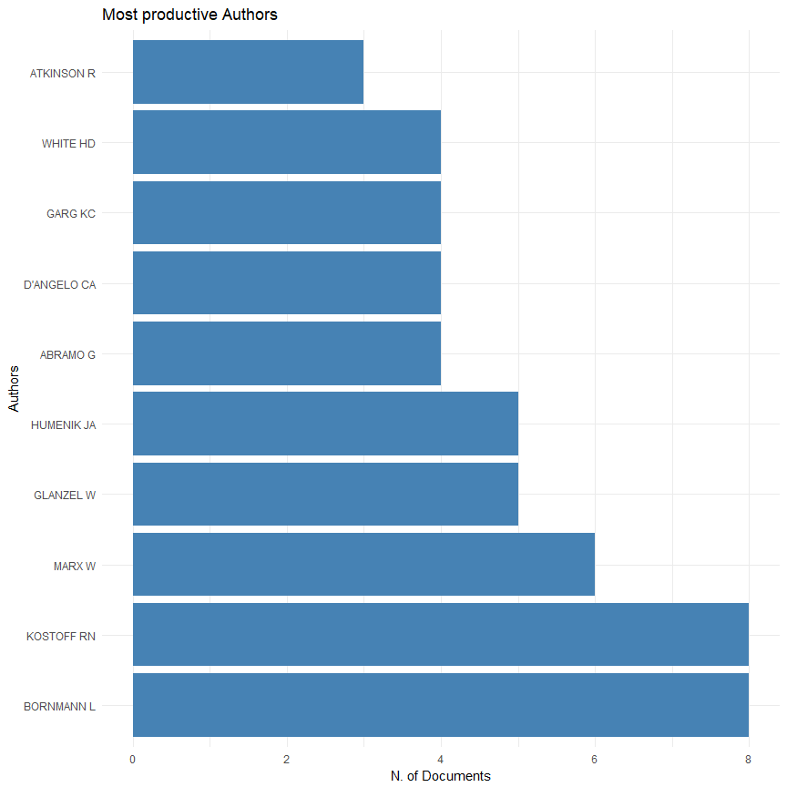<!-- -->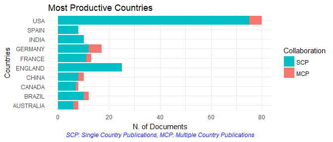<!-- -->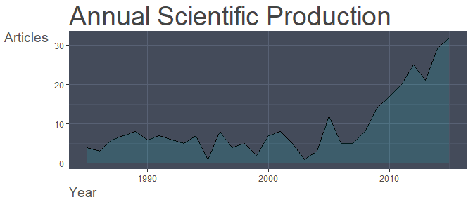<!-- -->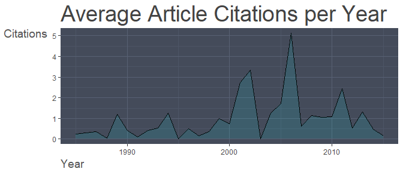<!-- -->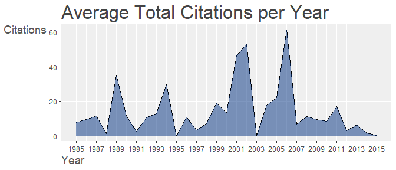<!-- -->

## Analysis of Cited References 
The function *citations* generates the frequency table of the most cited references or the most cited first authors (of references).

For each manuscript, cited references are in a single string stored in the column "CR" of the data frame. 

For a correct extraction, you need to identify the separator field among different references, used by ISI or SCOPUS database. Usually, the default separator is ";" or `".  "` (a dot with double space).


```r
# M$CR[1]
```
The figure shows the reference string of the first manuscript. In this case, the separator field is `sep = ".  "`.

<div style="width:900px; height=600px">

</div>


To obtain the most frequent cited manuscripts:

```r
CR <- citations(M, field = "article", sep = ".  ")
cbind(CR$Cited[1:10])
```

```
##                                                                               [,1]
## HIRSCH JE, 2005, P NATL ACAD SCI USA, V102, P16569, DOI 101073/PNAS0507655102   26
## SMALL H, 1973, J AM SOC INFORM SCI, V24, P265, DOI 101002/ASI4630240406         19
## DE SOLLA PRICE DJ, 1963, LITTLE SCI BIG SCI                                     15
## PRITCHARA, 1969, J DOC, V25, P348                                               14
## BRADFORD S C, 1934, ENGINEERING-LONDON, V137, P85                               13
## GARFIELD E, 2006, JAMA-J AM MED ASSOC, V295, P90, DOI 101001/JAMA295190         11
## COLE FRANCIS J, 1917, SCI PROGR, V11, P578                                      10
## KESSLER MM, 1963, AM DOC, V14, P10, DOI 101002/ASI5090140103                    10
## SMALL HG, 1978, SOC STUD SCI, V8, P327, DOI 101177/030631277800800305           10
## SMITH LC, 1981, LIBR TRENDS, V30, P83                                           10
```

To obtain the most frequent cited first authors:

```r
CR <- citations(M, field = "author", sep = ".  ")
cbind(CR$Cited[1:10])
```

```
##               [,1]
## GARFIELD E     129
## BORNMANN L      81
## SMALL H         62
## CRONIN B        53
## GLANZEL W       48
## WHITE HD        48
## KOSTOFF RN      45
## NARIN F         41
## LEYDESDORFF L   40
## BROOKES BC      38
```

The function *localCitations* generates the frequency table of the most local cited authors.
Local citations measures how many times an author (or a document) included in this collection have been cited by other authors also in the collection.

To obtain the most frequent local cited authors:

```r
CR <- localCitations(M, sep = ".  ")
```

```
## Articles analysed   100 
## Articles analysed   200 
## Articles analysed   202
```

```r
CR$Authors[1:10,]
```

```
##          Author LocalCitations
## 38   BROADUS RN              7
## 1      ABRAMO G              6
## 15     BARKER K              6
## 61  D'ANGELO CA              6
## 139    HOLDEN G              6
## 276 ROSENBERG G              6
## 31   BORNMANN L              5
## 350  WILLIAMS R              5
## 290 SENGUPTA IN              4
## 300    SMITH DR              4
```

```r
CR$Papers[1:10,]
```

```
##                                    Paper                              DOI Year LCS GCS
## 83  HOLDEN G, 2005, SOC WORK HEALTH CARE          10.1300/J010V41N03\\_01 2005   6  22
## 9       BROADUS RN, 1987, SCIENTOMETRICS               10.1007/BF02016680 1987   5  38
## 177        BORNMANN L, 2013, J INFORMETR        10.1016/J.JOI.2013.02.005 2013   5  10
## 34              SENGUPTA IN, 1992, LIBRI        10.1515/LIBR.1992.42.2.75 1992   4  20
## 6        PERSSON O, 1986, SCIENTOMETRICS               10.1007/BF02016861 1986   3  15
## 59                 CRONIN B, 2000, J DOC         10.1108/EUM0000000007123 2000   3  20
## 65           TRAYNOR M, 2001, J ADV NURS 10.1046/J.1365-2648.2001.02017.X 2001   3   8
## 91       GLANZEL W, 2006, SCIENTOMETRICS       10.1556/SCIENT.67.2006.2.8 2006   3  41
## 103   SMITH DR, 2008, CONTACT DERMATITIS 10.1111/J.1600-0536.2008.01405.X 2008   3  11
## 114           ABRAMO G, 2009, RES POLICY     10.1016/J.RESPOL.2008.11.001 2009   3  43
```


## Authors' Dominance ranking

The function *dominance* calculates the authors' dominance ranking as proposed by Kumar & Kumar, 2008.

Function arguments are: *results* (object of class *bibliometrix*) obtained by *biblioAnalysis*; and *k* (the number of authors to consider in the analysis).


```r
DF <- dominance(results, k = 10)
DF
```

```
##             Dominance Factor Multi Authored First Authored Rank by Articles Rank by DF
## KOSTOFF RN         1.0000000              8              8                2          1
## HOLDEN G           1.0000000              3              3               10          2
## ABRAMO G           0.7500000              4              3                5          3
## GARG KC            0.7500000              4              3                7          4
## BORNMANN L         0.6250000              8              5                1          5
## GLANZEL W          0.6000000              5              3                4          6
## BORGMAN CL         0.3333333              3              1                9          7
## D'ANGELO CA        0.2500000              4              1                6          8
## WHITE HD           0.2500000              4              1                8          9
## MARX W             0.1666667              6              1                3         10
```

The Dominance Factor is a ratio indicating the fraction of multi-authored articles in which a scholar appears as the first author.

In this example, Kostoff and Holden dominate their research team because they appear as the first authors in all their papers (8 for Kostoff and 3 for Holden). 

## Authors' h-index
The h-index is an author-level metric that attempts to measure both the productivity and citation impact of the publications of a scientist or scholar. 

The index is based on the set of the scientist's most cited papers and the number of citations that they have received in other publications.

The function *Hindex* calculates the authors' H-index and its variants (g-index and m-index) in a bibliographic collection.

Function arguments are: *M* a bibliographic data frame; *authors* a character vector containing the authors' names for which you want to calculate the H-index. The argument has the form c("SURNAME1 N","SURNAME2 N",...). 

In other words, for each author: surname and initials are separated by one blank space. 
i.e for the authors ARIA MASSIMO and CUCCURULLO CORRADO, *authors* argument is *authors = c("ARIA M", "CUCCURULLO C")*.

To calculate the h-index of Lutz Bornmann in this collection:


```r
indices <- Hindex(M, authors="BORNMANN L", sep = ";",years=10)

# Bornmann's impact indices:
indices$H
```

```
##       Author h_index g_index   m_index TC NP
## 1 BORNMANN L       4       7 0.5714286 50  8
```

```r
# Bornmann's citations
indices$CitationList
```

```
## [[1]]
##                          Authors                        Journal Year TotalCitation
## 2              MARX W;BORNMANN L SOZIALE WELT-ZEITSCHRIFT FUR S 2015             0
## 4       BORNMANN L;LEYDESDORFF L        JOURNAL OF INFORMETRICS 2014             1
## 8 BORNMANN L;BOWMAN BF;BAUER J;M     ZEITSCHRIFT FUR EVALUATION 2012             2
## 3                     BORNMANN L            RESEARCH EVALUATION 2014             3
## 1              BORNMANN L;MARX W        JOURNAL OF INFORMETRICS 2015             5
## 6          BORNMANN L;WILLIAMS R        JOURNAL OF INFORMETRICS 2013            10
## 7              BORNMANN L;MARX W        JOURNAL OF INFORMETRICS 2013            11
## 5                     BORNMANN L JOURNAL OF THE AMERICAN SOCIET 2013            18
```

To calculate the h-index of the first 10 most productive authors (in this collection):


```r
authors=gsub(","," ",names(results$Authors)[1:10])

indices <- Hindex(M, authors, sep = ";",years=50)

indices$H
```

```
##         Author h_index g_index   m_index  TC NP
## 1   BORNMANN L       4       7 0.5714286  50  8
## 2   KOSTOFF RN       8       8 0.4000000 276  8
## 3       MARX W       3       6 0.3750000  36  6
## 4    GLANZEL W       2       5 0.0800000  64  5
## 5   HUMENIK JA       5       5 0.2631579 213  5
## 6     ABRAMO G       4       4 0.4000000 158  4
## 7  D'ANGELO CA       4       4 0.4000000 158  4
## 8      GARG KC       4       4 0.1481481  41  4
## 9     WHITE HD       4       4 0.1333333 248  4
## 10  ATKINSON R       0       0 0.0000000   0  3
```


## Lotka's Law coefficient estimation
The function *lotka* estimates Lotka's law coefficients for scientific productivity (Lotka A.J., 1926).

Lotka's law describes the frequency of publication by authors in any given field as an inverse square law, where the number of authors publishing a certain number of articles is a fixed ratio to the number of authors publishing a single article.
This assumption implies that the theoretical beta coefficient of Lotka's law is equal to 2.

Using *lotka* function is possible to estimate the Beta coefficient of our bibliographic collection and assess, through a statistical test, the similarity of this empirical distribution with the theoretical one.


```r
L <- lotka(results)

# Author Productivity. Empirical Distribution
L$AuthorProd
```

```
##   N.Articles N.Authors        Freq
## 1          1       466 0.871028037
## 2          2        47 0.087850467
## 3          3        13 0.024299065
## 4          4         4 0.007476636
## 5          5         2 0.003738318
## 6          6         1 0.001869159
## 7          8         2 0.003738318
```

```r
# Beta coefficient estimate
L$Beta
```

```
## [1] 2.976457
```

```r
# Constant
L$C
```

```
## [1] 0.6634829
```

```r
# Goodness of fit
L$R2
```

```
## [1] 0.9413535
```

```r
# P-value of K-S two sample test
L$p.value
```

```
## [1] 0.2031888
```

The table L$AuthorProd shows the observed distribution of scientific productivity in our example.

The estimated Beta coefficient is 3.05 with a goodness of fit equal to 0.94. Kolmogorov-Smirnoff two sample test provides a p-value 0.09 that means there is not a significant difference between the observed and the theoretical Lotka distributions.

You can compare the two distributions using *plot* function:


```r
# Observed distribution
Observed=L$AuthorProd[,3]

# Theoretical distribution with Beta = 2
Theoretical=10^(log10(L$C)-2*log10(L$AuthorProd[,1]))

plot(L$AuthorProd[,1],Theoretical,type="l",col="red",ylim=c(0, 1), xlab="Articles",ylab="Freq. of Authors",main="Scientific Productivity")
lines(L$AuthorProd[,1],Observed,col="blue")
legend(x="topright",c("Theoretical (B=2)","Observed"),col=c("red","blue"),lty = c(1,1,1),cex=0.6,bty="n")
```


## Bibliographic network matrices
Manuscript's attributes are connected to each other through the manuscript itself: author(s) to journal, keywords to publication date, etc.

These connections of different attributes generate bipartite networks that can be represented as rectangular matrices (Manuscripts x Attributes).

Furthermore, scientific publications regularly contain references to
other scientific works. This generates a further network, namely, co-citation or coupling network.

These networks are analyzed in order to capture meaningful properties of the underlying research system, and in particular to determine the influence of bibliometric units such as scholars and journals.

### Bipartite networks
*cocMatrix* is a general function to compute a bipartite network selecting one of the metadata attributes.

For example, to create a network *Manuscript x Publication Source* you have to use the field tag "SO":


```r
A <- cocMatrix(M, Field = "SO", sep = ";")
```

A is a rectangular binary matrix, representing a bipartite network where rows and columns are manuscripts and sources respectively. 

The generic element $a_{ij}$ is 1 if the manuscript $i$ has been published in source $j$, 0 otherwise. 

The $j-th$ column sum $a_j$ is the number of manuscripts published in source $j$. 

Sorting, in decreasing order, the column sums of A, you can see the most relevant publication sources:


```r
sort(Matrix::colSums(A), decreasing = TRUE)[1:5]
```

```
##                                                         SCIENTOMETRICS 
##                                                                     49 
## JOURNAL OF THE AMERICAN SOCIETY FOR INFORMATION SCIENCE AND TECHNOLOGY 
##                                                                     14 
##                JOURNAL OF THE AMERICAN SOCIETY FOR INFORMATION SCIENCE 
##                                                                      8 
##                                                JOURNAL OF INFORMETRICS 
##                                                                      6 
##                                               JOURNAL OF DOCUMENTATION 
##                                                                      6
```


Following this approach, you can compute several bipartite networks:

* Citation network

```r
# A <- cocMatrix(M, Field = "CR", sep = ".  ")
```

* Author network

```r
# A <- cocMatrix(M, Field = "AU", sep = ";")
```

* Country network

Authors' Countries is not a standard attribute of the bibliographic data frame. You need to extract this information from affiliation attribute using the function *metaTagExtraction*.


```r
M <- metaTagExtraction(M, Field = "AU_CO", sep = ";")
# A <- cocMatrix(M, Field = "AU_CO", sep = ";")
```

*metaTagExtraction* allows to extract the following additional field tags: *Authors' countries* (`Field = "AU_CO"`); *First Author's countries* (`Field = "AU_CO"`); *First author of each cited reference* (`Field = "CR_AU"`); *Publication source of each cited reference* (`Field = "CR_SO"`); and *Authors' affiliations* (`Field = "AU_UN"`).

* Author keyword network

```r
# A <- cocMatrix(M, Field = "DE", sep = ";")
```

* Keyword Plus network

```r
# A <- cocMatrix(M, Field = "ID", sep = ";")
```

* Etc.

### Bibliographic coupling 

Two articles are said to be bibliographically coupled if at least one cited source appears in the bibliographies or reference lists of both articles (Kessler, 1963).

A coupling network can be obtained using the general formulation:

$$
B = A \times A^T
$$
where A is a bipartite network.

Element $b_{ij}$ indicates how many bibliographic couplings exist between manuscripts $i$ and $j$. In other words, $b_{ij}$ gives the number of paths of length 2, via which one moves from $i$ along the arrow and then to $j$ in the opposite direction.

$B$ is a symmetrical matrix $B = B^T$.

The strength of the coupling of two articles, $i$ and $j$ is defined
simply by the number of references that the articles have in common, as given by the element $b_{ij}$ of matrix $B$.

The function *biblioNetwork* calculates, starting from a bibliographic  data frame, the most frequently used coupling networks: Authors, Sources, and Countries.

*biblioNetwork* uses two arguments to define the network to compute:

* *analysis* argument can be "co-citation", "coupling", "collaboration",  or "co-occurrences".

* *network* argument can be "authors", "references", "sources", "countries", "universities", "keywords", "author_keywords", "titles" and "abstracts".

The following code calculates a classical article coupling network:

```r
# NetMatrix <- biblioNetwork(M, analysis = "coupling", network = "references", sep = ".  ")
```

Articles with only a few references, therefore, would tend to be more weakly bibliographically coupled, if coupling strength is measured simply according to the number of references that articles contain in common. 

This suggests that it might be more practical to switch to a relative measure of bibliographic coupling.

*normalizeSimilarity* function calculates Association strength, Inclusion, Jaccard or Salton similarity among vertices of a network. *normalizeSimilarity* can be recalled directly from *networkPlot()* function using the argument *normalize*. 


```r
NetMatrix <- biblioNetwork(M, analysis = "coupling", network = "authors", sep = ";")

# plot authors' similarity (first 20 authors), using salton similarity index
net=networkPlot(NetMatrix,  normalize = "salton", weighted=NULL, n = 100, Title = "Authors' Coupling", type = "fruchterman", size=5,size.cex=T,remove.multiple=TRUE,labelsize=0.8,label.n=10,label.cex=F)
```

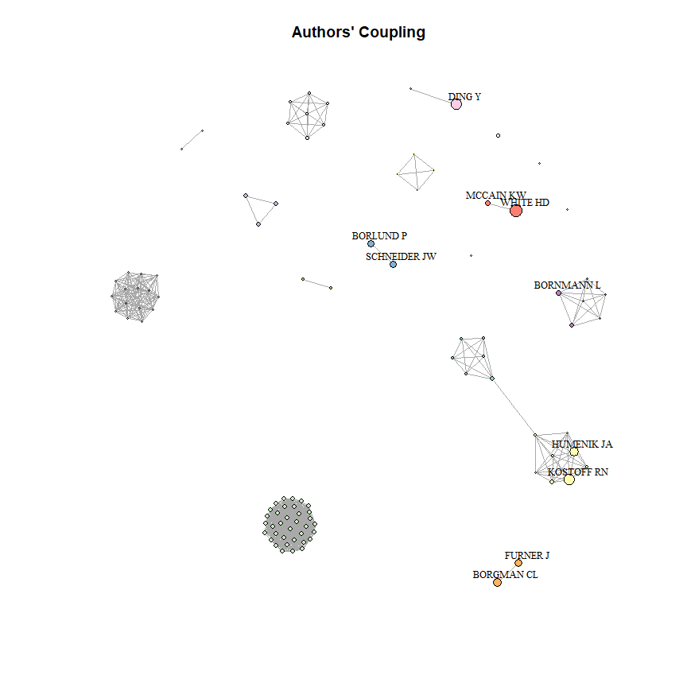<!-- -->


### Bibliographic co-citation

We talk about co-citation of two articles when
both are cited in a third article. Thus, co-citation can be seen as the counterpart of bibliographic coupling.

A co-citation network can be obtained using the general formulation:

$$
C = A^T \times A
$$
where A is a bipartite network.

Like matrix $B$, matrix $C$ is also symmetric. The main diagonal
of $C$ contains the number of cases in which a reference is cited in our data frame. 

In other words, the diagonal element $c_{i}$ is the number of local citations of the reference $i$.

Using the function *biblioNetwork*, you can calculate a classical reference co-citation network:

```r
# NetMatrix <- biblioNetwork(M, analysis = "co-citation", network = "references", sep = ".  ")
```

### Bibliographic collaboration

Scientific collaboration network is a network where nodes are authors and links are co-authorships as the latter is one of the most well-documented forms of scientific collaboration (Glanzel, 2004).

An author collaboration network can be obtained using the general formulation:

$$
AC = A^T \times A
$$
where A is a bipartite network *Manuscripts x Authors*.

The diagonal element $ac_{i}$ is the number of manuscripts authored or co-authored by researcher $i$.

Using the function *biblioNetwork*, you can calculate an authors' collaboration network:

```r
# NetMatrix <- biblioNetwork(M, analysis = "collaboration", network = "authors", sep = ";")
```

or a country collaboration network:

```r
# NetMatrix <- biblioNetwork(M, analysis = "collaboration", network = "countries", sep = ";")
```

## Descriptive analysis of network graph characteristics

The function *networkStat* calculates several summary statistics.

In particular, starting from a bibliographic matrix (or an *igraph* object), two groups of descriptive measures are computed:

* The summary statistics of the network; 

* The main indices of centrality and prestige of vertices.


```r
# An example of a classical keyword co-occurrences network

NetMatrix <- biblioNetwork(M, analysis = "co-occurrences", network = "keywords", sep = ";")
netstat <- networkStat(NetMatrix)
```


### The summary statistics of the network

This group of statistics allows to describe the structural properties of a network:

* **Size** is the number of verticex composing the network;

* **Density** is the proportion of present edges from all possible edges in the network;

* **Transitivity** is the ratio of triangles to connected triples;

* **Diameter** is the longest geodesic distance (length of the shortest path between two nodes) in the network;

* **Degree distribution** is the cumulative distribution of vertex degrees;

* **Degree centralization** is the normalized degree of the overall network;

* **Closeness centralization** is the normalized inverse of the vertex’s average geodesic distance to others in the network;

* **Eigenvector centralization** is the first eigenvector of the graph matrix;

* **Betweenness centralization** is the normalized number of geodesics that pass through the vertex;

* **Average path length** is the mean of the shortest distance between each pair of vertices in the network.


```r
names(netstat$network)
```

```
##  [1] "networkSize"             "networkDensity"          "networkTransitivity"     "networkDiameter"        
##  [5] "networkDegreeDist"       "networkCentrDegree"      "networkCentrCloseness"   "networkCentrEigen"      
##  [9] "networkCentrbetweenness" "NetworkAverPathLeng"
```

### The main indices of centrality and prestige of vertices

These measures help to identify the most important vertices in a network and the propensity of two vertices that are connected to be both connected to a third vertex.

The statistics, at vertex level, returned by *networkStat* are:

* **Degree centrality**

* **Closeness centrality** measures how many steps are required to access every other vertex from a given vertex;

* **Eigenvector centrality** is a measure of being well-connected connected to the well-connected;

* **Betweenness centrality** measures brokerage or gatekeeping potential. It is (approximately) the number of shortest paths between vertices that pass through a particular vertex;

* **PageRank score** approximates probability that any message will arrive to a particular vertex. This algorithm was developed by Google founders, and originally applied to website links;

* **Hub Score** estimates the value of the links outgoing from the vertex. It was initially applied to the web pages;

* **Authority Score** is another measure of centrality initially applied to the Web. A vertex has high authority when it is linked by many other vertices that are linking many other vertices;

* **Vertex Ranking** is an overall vertex ranking obtained as a linear weighted combination of the centrality and prestige vertex measures. The weights are proportional to the loadings of the first component of the Principal Component Analysis.


```r
names(netstat$vertex)
```

```
## [1] "vertexID"               "vertexCentrDegree"      "vertexCentrCloseness"   "vertexCentrEigen"      
## [5] "vertexCentrBetweenness" "vertexPageRank"         "vertexHub"              "vertexAuthority"       
## [9] "Ranking"
```

To summarize the main results of the *networkStat* function, use the generic function *summary*.
It displays the main information about the network and vertex description through several tables.

*summary* accepts one additional argument. *k* is a formatting value that indicates the number of rows of each table. 
Choosing k=10, you decide to see the first 10 vertices.


```r
summary(netstat, k=10)
```

```
## 
## 
## Main statistics about the network
## 
##  Size                                  474 
##  Density                               0.024 
##  Transitivity                          0.335 
##  Diameter                              5 
##  Degree Centralization                 0.302 
##  Closeness Centralization              0.005 
##  Betweenness Centralization            0.286 
##  Eigenvector Centralization            0.907 
##  Average path length                   2.742 
##  
## 
## 
## 
## 
## 
## Main measures of centrality and prestige of vertices
## 
## 
## Degree Centrality: Top vertices
## 
##    Vertex ID              Degree Centrality
## 1     SCIENCE                         0.326
## 2     CITATION ANALYSIS               0.186
## 3     INDICATORS                      0.184
## 4     IMPACT                          0.178
## 5     CITATION                        0.175
## 6     JOURNALS                        0.150
## 7     PUBLICATION                     0.129
## 8     INFORMATION-SCIENCE             0.125
## 9     H-INDEX                         0.114
## 10    PERFORMANCE                     0.106
## 
## 
## Closeness Centrality: Top vertices
## 
##    Vertex ID              Closeness Centrality
## 1       SCIENCE                         0.0240
## 2       INDICATORS                      0.0239
## 3       CITATION                        0.0239
## 4       JOURNALS                        0.0239
## 5       IMPACT                          0.0239
## 6       CITATION ANALYSIS               0.0239
## 7       GOOGLE SCHOLAR                  0.0239
## 8       PUBLICATION                     0.0239
## 9       H-INDEX                         0.0238
## 10      SELF-CITATION                   0.0238
## 
## 
## Eigenvector Centrality: Top vertices
## 
##    Vertex ID              Eigenvector Centrality
## 1     SCIENCE                              1.000
## 2     CITATION ANALYSIS                    0.677
## 3     CITATION                             0.677
## 4     JOURNALS                             0.673
## 5     INDICATORS                           0.670
## 6     IMPACT                               0.615
## 7     PUBLICATION                          0.607
## 8     H-INDEX                              0.507
## 9     INFORMATION-SCIENCE                  0.472
## 10    GOOGLE SCHOLAR                       0.462
## 
## 
## Betweenness Centrality: Top vertices
## 
##    Vertex ID              Betweenness Centrality
## 1       SCIENCE                           0.2883
## 2       INDICATORS                        0.1142
## 3       IMPACT                            0.1026
## 4       CITATION                          0.0796
## 5       CITATION ANALYSIS                 0.0707
## 6       JOURNALS                          0.0538
## 7       PUBLICATION                       0.0445
## 8       GOOGLE SCHOLAR                    0.0380
## 9       SURFACE                           0.0379
## 10      POLICY                            0.0379
## 
## 
## PageRank Score: Top vertices
## 
##    Vertex ID              Pagerank Score
## 1     SCIENCE                    0.02476
## 2     INDICATORS                 0.01442
## 3     IMPACT                     0.01412
## 4     CITATION ANALYSIS          0.01361
## 5     CITATION                   0.01266
## 6     JOURNALS                   0.01068
## 7     PUBLICATION                0.00953
## 8     INFORMATION-SCIENCE        0.00910
## 9     H-INDEX                    0.00841
## 10    PERFORMANCE                0.00836
## 
## 
## Hub Score: Top vertices
## 
##    Vertex ID              Hub Score
## 1     SCIENCE                 1.000
## 2     CITATION ANALYSIS       0.677
## 3     CITATION                0.677
## 4     JOURNALS                0.673
## 5     INDICATORS              0.670
## 6     IMPACT                  0.615
## 7     PUBLICATION             0.607
## 8     H-INDEX                 0.507
## 9     INFORMATION-SCIENCE     0.472
## 10    GOOGLE SCHOLAR          0.462
## 
## 
## Authority Score: Top vertices
## 
##    Vertex ID              Authority Score
## 1     SCIENCE                       1.000
## 2     CITATION ANALYSIS             0.677
## 3     CITATION                      0.677
## 4     JOURNALS                      0.673
## 5     INDICATORS                    0.670
## 6     IMPACT                        0.615
## 7     PUBLICATION                   0.607
## 8     H-INDEX                       0.507
## 9     INFORMATION-SCIENCE           0.472
## 10    GOOGLE SCHOLAR                0.462
## 
## 
## Overall Ranking: Top vertices
## 
##    Vertex ID              Overall Ranking
## 1     SCIENCE                           1
## 2     INDICATORS                        2
## 3     CITATION ANALYSIS                 3
## 4     IMPACT                            4
## 5     CITATION                          5
## 6     JOURNALS                          6
## 7     PUBLICATION                       7
## 8     INFORMATION-SCIENCE               8
## 9     H-INDEX                           9
## 10    GOOGLE SCHOLAR                   10
```


## Visualizing bibliographic networks

All bibliographic networks can be graphically visualized or
modeled.

Here, we show how to visualize networks using function *networkPlot* and *VOSviewer software* by Nees Jan van Eck and Ludo Waltman (http://www.vosviewer.com).

Using the function *networkPlot*, you can plot a network created by *biblioNetwork* using R routines or using *VOSviewer*.

The main argument of *networkPlot* is type. It indicates the network map layout: circle, kamada-kawai, mds, etc.
Choosing type="vosviewer", the function automatically: (i) saves the network into a pajek network file, named "vosnetwork.net"; (ii) starts an instance of VOSviewer which will map the file "vosnetwork.net".
You need to declare, using argument *vos.path*, the full path of the folder where VOSviewer software is located (es. vos.path='c:/software/VOSviewer').


### Country Scientific Collaboration


```r
# Create a country collaboration network

M <- metaTagExtraction(M, Field = "AU_CO", sep = ";")
NetMatrix <- biblioNetwork(M, analysis = "collaboration", network = "countries", sep = ";")

# Plot the network
net=networkPlot(NetMatrix, n = dim(NetMatrix)[1], Title = "Country Collaboration", type = "circle", size=TRUE, remove.multiple=FALSE,labelsize=0.8,cluster="none")
```

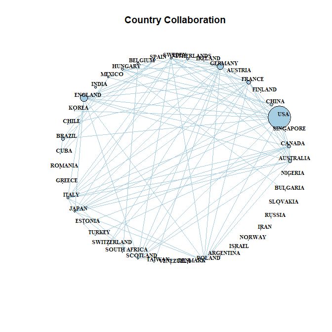<!-- -->


### Co-Citation Network


```r
# Create a co-citation network

NetMatrix <- biblioNetwork(M, analysis = "co-citation", network = "references", sep = ".  ")

# Plot the network
net=networkPlot(NetMatrix, n = 30, Title = "Co-Citation Network", type = "fruchterman", size=T, remove.multiple=FALSE, labelsize=0.7,edgesize = 5)
```

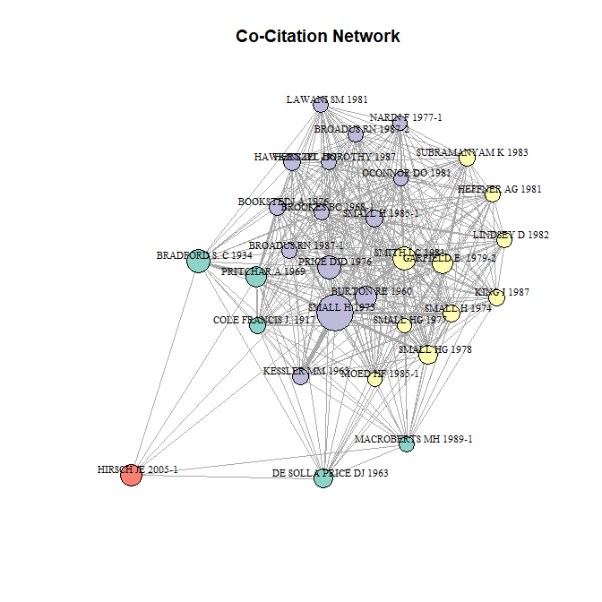<!-- -->

### Keyword co-occurrences


```r
# Create keyword co-occurrences network

NetMatrix <- biblioNetwork(M, analysis = "co-occurrences", network = "keywords", sep = ";")

# Plot the network
net=networkPlot(NetMatrix, normalize="association", weighted=T, n = 30, Title = "Keyword Co-occurrences", type = "fruchterman", size=T,edgesize = 5,labelsize=0.7)
```

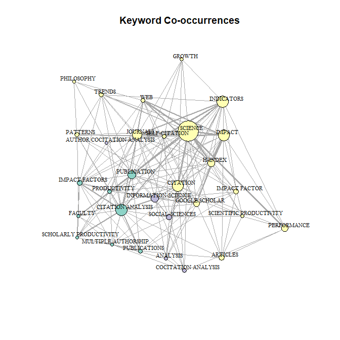<!-- -->

## Co-Word Analysis: The conceptual structure of a field 
The aim of the co-word analysis is to map the conceptual structure of a framework using the word co-occurrences in a bibliographic collection.

The analysis can be performed through dimensionality reduction techniques such as Multidimensional Scaling (MDS), Correspondence Analysis (CA) or Multiple Correspondence Analysis (MCA). 

Here, we show an example using the function *conceptualStructure* that performs a CA or MCA to draw a conceptual structure of the field and K-means clustering to identify clusters of documents which express common concepts. Results are plotted on a two-dimensional map.

*conceptualStructure* includes natural language processing (NLP) routines (see the function *termExtraction*) to extract terms from titles and abstracts.  In addition, it implements the Porter's stemming algorithm to reduce inflected (or sometimes derived) words to their word stem, base or root form.


```r
# Conceptual Structure using keywords (method="CA")

CS <- conceptualStructure(M,field="ID", method="CA", minDegree=4, k.max=8, stemming=FALSE, labelsize=10, documents=10)
```

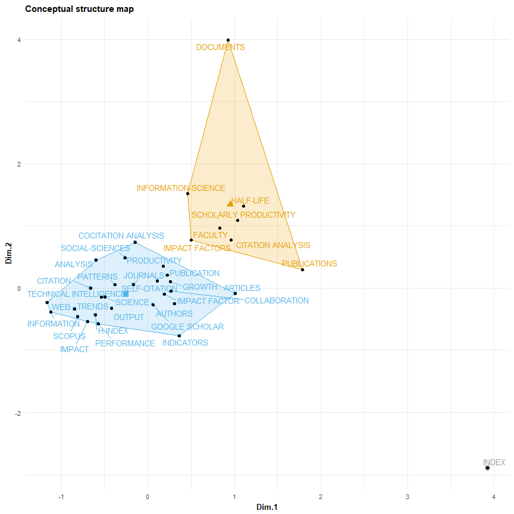<!-- -->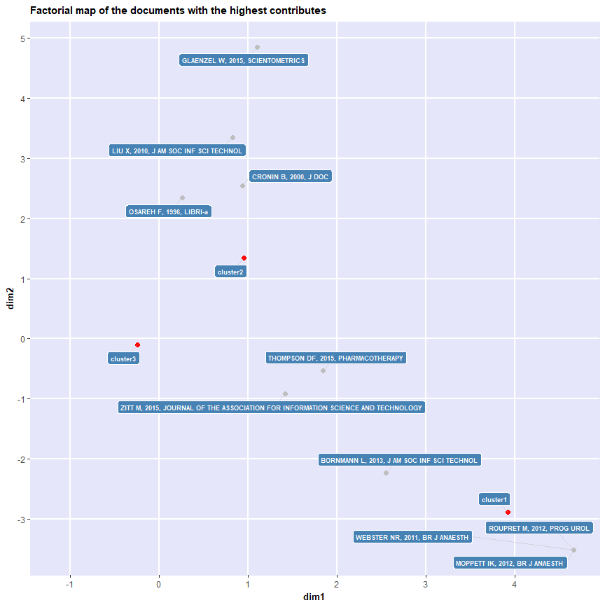<!-- -->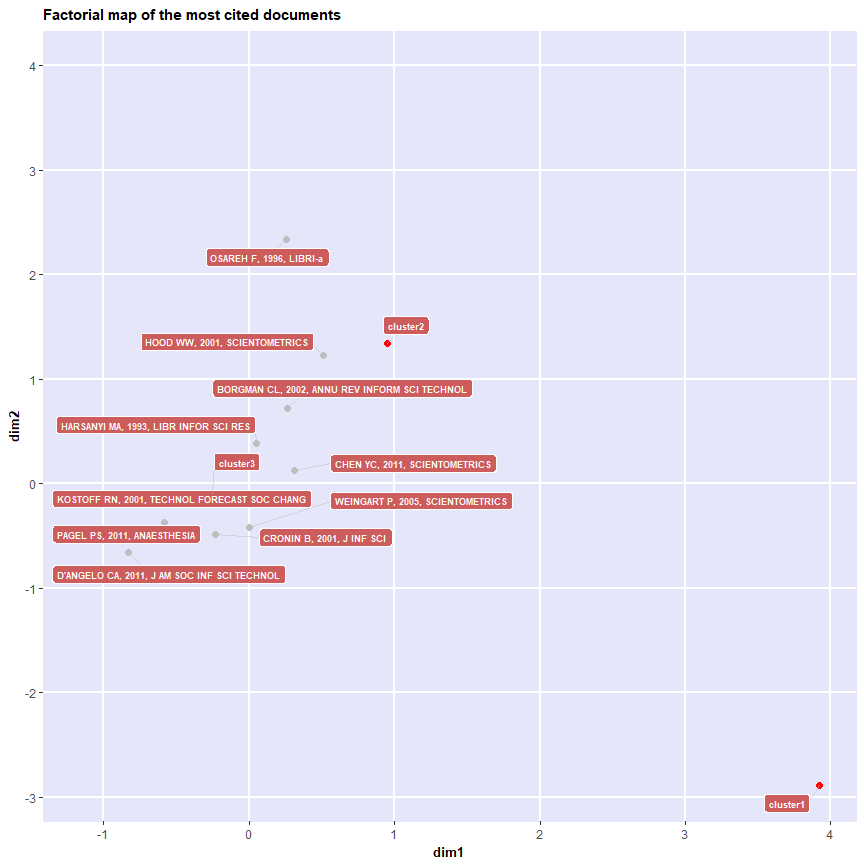<!-- -->

## Historical Direct Citation Network
The historiographic map is a graph proposed by E. Garfield to represent a chronological network map of most relevant direct citations resulting from a bibliographic collection.

The function \code{histNetwork} generates a chronological direct citation network matrix which can be plotted using *histPlot*:


```r
# Create a historical citation network
options(width=130)
histResults <- histNetwork(M, min.citations = 10, sep = ".  ")
```

```
## Articles analysed   81
```

```r
# Plot a historical co-citation network
net <- histPlot(histResults, n=10, size = 10, size.cex=TRUE, arrowsize = 0.5, color = FALSE)
```

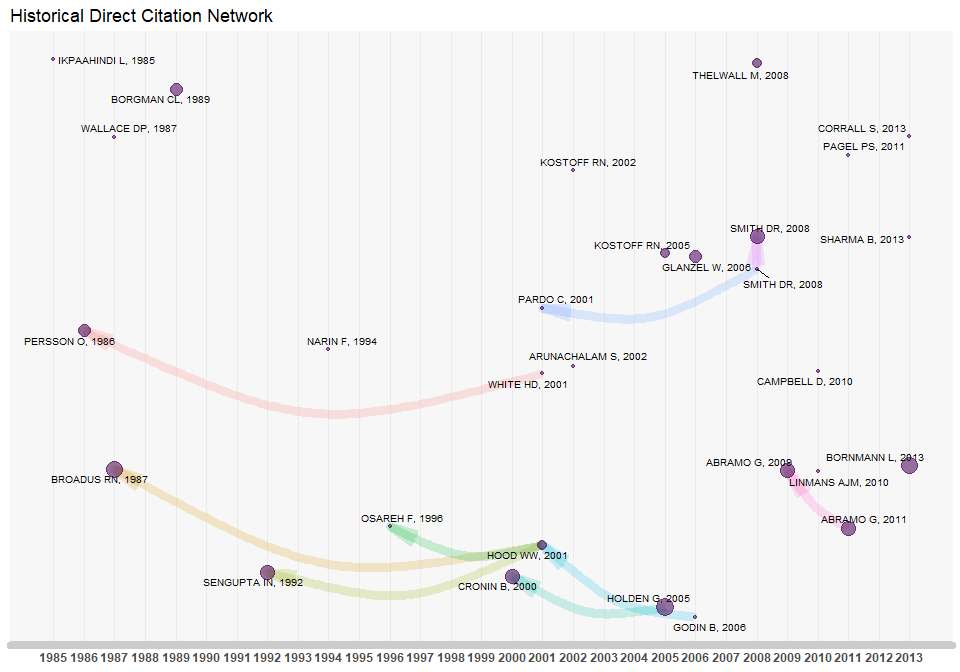<!-- -->

```
## 
##  Legend
## 
##                                          Paper                              DOI Year LCS GCS
## 1985 - 1             IKPAAHINDI L, 1985, LIBRI                             <NA> 1985   1  19
## 1986 - 2       PERSSON O, 1986, SCIENTOMETRICS               10.1007/BF02016861 1986   2  15
## 1987 - 3      BROADUS RN, 1987, SCIENTOMETRICS               10.1007/BF02016680 1987   4  38
## 1989 - 6          BORGMAN CL, 1989, COMMUN RES       10.1177/009365089016005002 1989   1  28
## 1992 - 14             SENGUPTA IN, 1992, LIBRI        10.1515/LIBR.1992.42.2.75 1992   3  20
## 1996 - 18                OSAREH F, 1996, LIBRI       10.1515/LIBR.1996.46.4.217 1996   1  23
## 2000 - 25                CRONIN B, 2000, J DOC         10.1108/EUM0000000007123 2000   3  20
## 2001 - 29        HOOD WW, 2001, SCIENTOMETRICS          10.1023/A:1017919924342 2001   1  71
## 2001 - 30            PARDO C, 2001, J ADV NURS 10.1046/J.1365-2648.2001.01931.X 2001   1  15
## 2005 - 43 HOLDEN G, 2005, SOC WORK HEALTH CARE          10.1300/J010V41N03\\_01 2005   3  22
## 2006 - 46        GODIN B, 2006, SCIENTOMETRICS        10.1007/S11192-006-0086-0 2006   1  31
## 2008 - 51      SMITH DR, 2008, NURS HEALTH SCI 10.1111/J.1442-2018.2008.00414.X 2008   1  23
## 2008 - 52          THELWALL M, 2008, J INF SCI         10.1177/0165551507087238 2008   1  32
## 2008 - 53   SMITH DR, 2008, CONTACT DERMATITIS 10.1111/J.1600-0536.2008.01405.X 2008   3  11
## 2009 - 60           ABRAMO G, 2009, RES POLICY     10.1016/J.RESPOL.2008.11.001 2009   2  43
## 2010 - 62    LINMANS AJM, 2010, SCIENTOMETRICS        10.1007/S11192-009-0088-9 2010   1  20
## 2011 - 67       ABRAMO G, 2011, SCIENTOMETRICS        10.1007/S11192-011-0459-X 2011   2  16
```

## Main Authors' references (about bibliometrics)

Aria, M. & Cuccurullo, C. (2017).  *bibliometrix*: An R-tool for comprehensive science mapping
  analysis, *Journal of Informetrics*, 11(4), pp 959-975, Elsevier, DOI: 10.1016/j.joi.2017.08.007 (https://doi.org/10.1016/j.joi.2017.08.007).

Cuccurullo, C., Aria, M., & Sarto, F. (2016). Foundations and trends in performance management. A twenty-five years bibliometric analysis in business and public administration domains, *Scientometrics*, DOI: 10.1007/s11192-016-1948-8 (https://doi.org/10.1007/s11192-016-1948-8).


Cuccurullo, C., Aria, M., & Sarto, F.  (2015). Twenty years of research on performance management in business and public administration domains. Presentation at the *Correspondence Analysis and Related Methods conference (CARME 2015)* in September 2015 (http://www.bibliometrix.org/documents/2015Carme_cuccurulloetal.pdf).


Sarto, F., Cuccurullo, C., & Aria, M. (2014). Exploring healthcare governance literature: systematic review and paths for future research. *Mecosan* (http://www.francoangeli.it/Riviste/Scheda_Rivista.aspx?IDarticolo=52780&lingua=en).


Cuccurullo, C., Aria, M., & Sarto, F. (2013). Twenty years of research on performance management in business and public administration domains. In *Academy of Management Proceedings* (Vol. 2013, No. 1, p. 14270). Academy of Management (https://doi.org/10.5465/AMBPP.2013.14270abstract).

